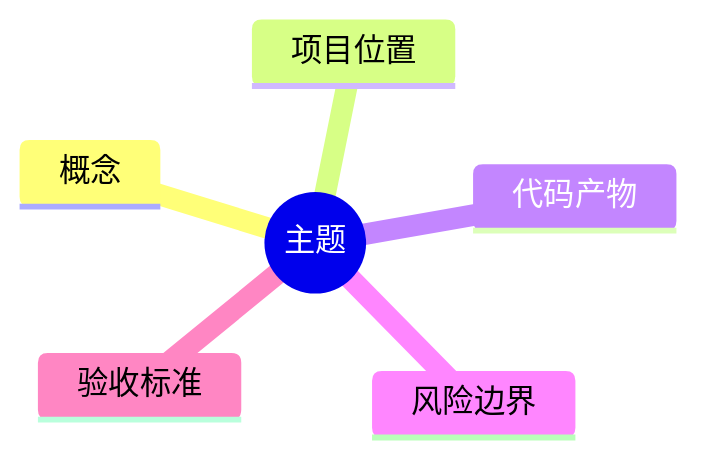

# AI Agent 教学路线与带学方案

## 定位

这份文档是教学执行手册，配合 `docs/AI_AGENT_DAILY_LEARNING_PATH.md` 使用。

- `docs/AI_AGENT_DAILY_LEARNING_PATH.md`：定义 45 天学什么、做什么、如何验收。
- `docs/AI_AGENT_TEACHING_GUIDE.md`：定义每天怎么学、怎么教、怎么沉淀、怎么复习。

目标不是快速堆出一个 Demo，而是让你从新手逐步建立 AI Agent 工程能力，并通过开发一个 MCP 优先的 Java 后端排障 Agent，把概念、代码、架构和生产化能力串起来。

## 教学原则

### 1. 项目驱动

所有知识点都必须落到 `projects/mcp-troubleshooting-agent`。

不孤立学习 LLM API、MCP、RAG、Memory，而是始终回答：

- 这个知识点解决排障 Agent 的什么问题？
- 它位于系统哪一层？
- 它对应哪个接口、类、工具、配置、测试或文档？
- 它有哪些边界和失败场景？

### 2. 由浅入深

每天只推进一个核心节点。

先建立最小可理解模型，再扩展到工程化能力：

```text
概念理解 -> 最小实现 -> 工程边界 -> 测试验证 -> 知识沉淀
```

### 3. 先只读，后审批

第一阶段只做只读排障 Agent。

允许：

- 查代码
- 查配置
- 查 Git 历史
- 查文档
- 查本地日志样本
- 生成诊断报告

不允许：

- 重启服务
- 修改配置
- 写数据库
- 触发部署
- 调生产 API

写操作只在后期作为 Human-in-the-loop 设计，不在第一阶段真实执行。

### 4. 每天都要有验收

每天结束时必须留下一个可验证产物。

产物可以是：

- 一张架构图
- 一个接口设计
- 一个最小可运行功能
- 一个测试用例
- 一份知识卡片
- 一份技术决策记录
- 一次端到端运行记录

没有验收，不标记为已学习。

## 角色分工

### 我作为教授

我负责：

- 用新手能理解的方式讲清概念
- 把概念映射到当前项目
- 拆出当天最小任务
- 解释代码和架构取舍
- 带你运行命令、看日志、定位报错
- 做代码审查和设计审查
- 出复习题和追问
- 帮你更新学习进度和知识沉淀

我不会：

- 一次性塞太多概念
- 为了炫技引入复杂框架
- 跳过验证直接说完成
- 把危险写操作做成默认能力

### 你作为学习者

你负责：

- 每天按一个节点学习
- 对不懂的地方及时追问
- 尝试用自己的话解释概念
- 确认当天产物是否能理解
- 完成当天设置的 Agent 核心复习问题；如果当天没有必要的复习问题，可以跳过
- 允许我在你理解不稳时放慢节奏

## 每日教学流程

每次学习建议 60 到 90 分钟。

### Step 1：今日目标

先明确今天学什么，以及为什么要学。

格式：

```text
今日节点：Day XX
今日主题：
今天解决的问题：
今天不解决的问题：
最终产物：
验收标准：
```

### Step 2：概念讲解

只讲当天必要概念。

讲解顺序：

1. 用一句话定义概念
2. 说明它解决什么问题
3. 说明它不解决什么问题
4. 给一个和 Java 后端开发相关的类比
5. 放到排障 Agent 架构里定位

### Step 3：项目映射

每个知识点必须落到项目结构。

示例：

```text
Tool Calling
-> Agent 需要调用 search_code / git_history / read_config
-> 初期是本地 Java 接口
-> 后期迁移为 MCP Tool
-> 每次调用都写入 trace
```

### Step 4：动手构建

每天只做一个最小闭环。

要求：

- 代码少而清晰
- 边界明确
- 失败可解释
- 有测试或运行命令
- 不引入当天不需要的抽象

### Step 5：运行验证

验证必须基于证据。

常见证据：

- 命令输出
- 单元测试结果
- 接口返回
- trace 文件
- 日志片段
- 生成的诊断报告

### Step 6：复盘提问

复盘提问只服务 Agent 学习目标，不机械凑数量。

如果当天内容直接关系到 Agent 核心能力、边界或风险，我会问 1-3 个高价值问题。

如果当天主要是工程支撑、目录、依赖、配置样板或文档整理，且没有必须确认的 Agent 概念，可以省略复习问题。

问题类型：

- 概念边界题
- 项目映射题
- 设计取舍题
- 故障推理题
- 安全边界题

只有当天设置了复习问题时，回答到位才作为标记已学习的门槛。

### Step 7：知识沉淀

每天结束后沉淀到 `docs/knowledge`。

推荐结构：

```text
docs/knowledge/
  concepts/        # 概念卡片
  mindmaps/        # Mermaid 脑图
  decisions/       # 技术决策记录
  review-notes/    # 每周复盘
```

## 知识沉淀格式

### 概念卡片

路径：

```text
docs/knowledge/concepts/day-XX-<topic>.md
```

模板：

```markdown
# Day XX：概念名称

## 一句话定义

## 解决的问题

## 不解决的问题

## 在本项目中的位置

## 最小代码证据

## 常见误区

## 自测问题

## 今日结论
```

### 脑图

路径：

```text
docs/knowledge/mindmaps/day-XX-<topic>.md
```

模板：

````markdown
# Day XX 脑图：主题


````

### 技术决策记录

路径：

```text
docs/knowledge/decisions/ADR-XXXX-<topic>.md
```

模板：

```markdown
# ADR-XXXX：决策主题

## 背景

## 决策

## 备选方案

## 取舍

## 后果

## 复查条件
```

### 每周复盘

路径：

```text
docs/knowledge/review-notes/week-XX.md
```

模板：

```markdown
# 第 XX 周复盘

## 本周学到的核心概念

## 本周完成的项目能力

## 我现在能解释什么

## 我还没真正理解什么

## 下周风险点

## 需要回看和重练的节点
```

## 45 天教学推进方式

### 第 1 周：打基础，不急着写复杂代码

目标：

- 分清 LLM 应用、Tool Calling 应用、Agent 应用
- 明确排障 Agent 的 MVP
- 学会 Prompt / Instruction 的基本边界
- 初始化项目骨架
- 设计配置和运行入口

教学重点：

- 建立正确心智模型
- 避免一开始就陷入框架细节
- 明确只读边界

### 第 2 周：让模型能稳定输出和调用工具

目标：

- 接通 LLM API
- 实现结构化输出
- 设计 Tool Calling 接口
- 实现本地只读工具

教学重点：

- 模型输出不可信，必须解析和校验
- 工具参数要有 schema
- 工具结果要有统一结构

### 第 3 周：把工具迁移到 MCP

目标：

- 理解 MCP Client / Server
- 暴露 `search_code`、`git_history`、`read_config`
- 让 Agent 通过 MCP 调用工具

教学重点：

- Agent 不依赖具体工具实现
- 工具能力标准化
- 工具元数据包含权限信息

### 第 4 周：补齐 MCP 完整协议视角

目标：

- 学习 Tools、Resources、Prompts、Roots
- 建立 MCP contract test

教学重点：

- MCP 不只是工具调用
- Resources 适合上下文暴露
- Prompts 适合标准化工作流
- Roots 是访问边界

### 第 5 周：构建 RAG 知识检索链路

目标：

- 建立知识库
- 支持全文检索
- 评估 query rewrite、embedding、hybrid search、rerank
- 让诊断报告带来源引用

教学重点：

- RAG 的核心不是“像真的”，而是可追溯证据
- 检索质量需要评测
- 没有来源的结论必须标记为推断

### 第 6 周：加入 Memory 与上下文压缩

目标：

- 区分短期记忆、长期记忆、项目事实和历史经验
- 实现工具结果压缩
- 设计上下文预算和压缩策略

教学重点：

- 记忆不是无限追加聊天记录
- 长期记忆必须有来源
- 压缩不能破坏证据链

### 第 7 周：实现 Agent 编排闭环

目标：

- 实现 Plan、Act、Observe、Reflect、Answer
- 让 Agent 能多轮排障
- 输出完整诊断报告

教学重点：

- Agent 是状态机，不是 while(true) 调模型
- 每一轮都要可追踪
- 必须有最大轮数和收敛条件

### 第 8 周：安全、观测、评测、测试

目标：

- 加入高风险操作审批设计
- 防 Prompt Injection
- 记录 trace、指标、失败样本
- 建立 eval case 和测试体系

教学重点：

- 日志、文档、Git diff 都是不可信输入
- 评测不是最后补的，是防退化机制
- 测试要覆盖工具、协议、RAG、Agent 输出

### 第 9 周：部署、性能和最终验收

目标：

- 提供 CLI 或 REST 入口
- 完成部署说明
- 设计缓存、限流、重试、超时
- 完成端到端验收与复盘

教学重点：

- 能运行才算工程
- 成本和延迟是 Agent 生产化问题
- 最终验收必须串起完整链路

## 每天开始学习时的指令

你可以直接说：

```text
开始 Day 01
```

我会按以下格式响应：

```text
1. 今日目标
2. 概念讲解
3. 项目映射
4. 实操任务
5. 验收方式
6. 复习问题（仅在必要时）
7. 知识沉淀清单
```

如果当天需要写代码，我会先解释设计，再动手实现。

如果当天只是概念和设计，我会产出文档、脑图或决策记录。

## 每天结束学习时的指令

你可以直接说：

```text
Day 01 学完了
```

我会检查：

- 今日产物是否存在
- 验收标准是否满足
- 是否有知识卡片
- 如当天有复习问题，是否已回答到位

然后更新：

- `docs/AI_AGENT_DAILY_LEARNING_PATH.md` 的 checkbox
- 学习记录
- 当前进度
- 必要的知识沉淀文件

## 学习质量门禁

一个节点只有同时满足下面条件，才标记为已学习：

- 能用自己的话解释当天核心概念
- 能说出该概念在本项目中的位置
- 有当天产物
- 有验证证据
- 有知识沉淀
- 没有明显未解决的关键问题

## 第一节课建议

从 Day 01 开始：

```text
开始 Day 01
```

Day 01 不写复杂代码，重点是建立三种应用的边界：

- 普通 LLM 应用
- Tool Calling 应用
- Agent 应用

当天产物建议：

- `docs/day-01-agent-workflow.md`
- `docs/knowledge/concepts/day-01-agent-vs-llm.md`
- `docs/knowledge/mindmaps/day-01-agent-workflow.md`

验收标准：

- 你能解释为什么“排障”比“普通问答”更适合 Agent
- 你能画出本项目的 Agent 工作流
- 你能说清 Tool Calling 和 Agent 编排的区别
