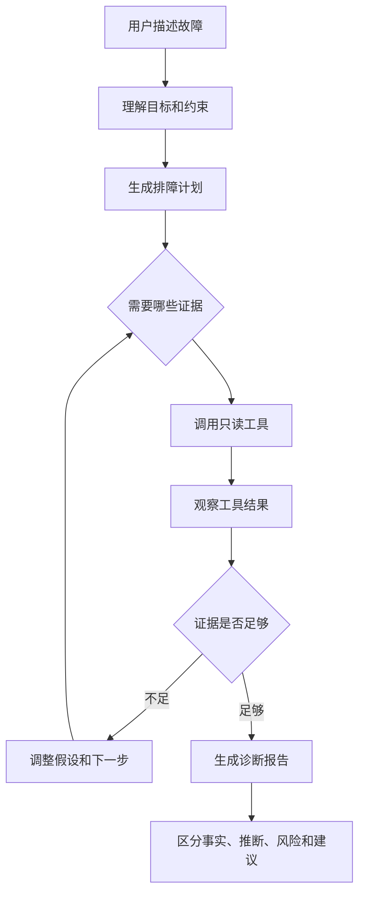

# Day 01：AI Agent 与普通 LLM 应用的区别

## 今日节点

Day 01：理解 AI Agent 与普通 LLM 应用的区别。

## 今日主题

把排障 Agent 看成一个多步证据收集循环，而不是一次模型问答。

## 今天解决的问题

- 普通 LLM 应用、Tool Calling 应用、Agent 应用分别是什么。
- 为什么 Java 后端排障更适合 Agent，而不是只靠一次问答。
- 本项目第一阶段的 Agent 工作流应该长什么样。

## 今天不解决的问题

- 不接入真实 LLM API。
- 不实现 Tool Calling。
- 不搭建 MCP Server。
- 不做 RAG、Memory、多 Agent 编排。
- 不执行重启、部署、改配置、写数据库等高风险操作。

## 三种应用的边界

| 类型 | 一句话定义 | 适合场景 | 不适合场景 |
| --- | --- | --- | --- |
| 普通 LLM 应用 | 用户输入问题，模型直接生成回答 | 翻译、总结、改写、解释概念 | 需要查证据、调用工具、持续决策的任务 |
| Tool Calling 应用 | 模型根据问题选择工具，程序执行工具并返回结果 | 查天气、查订单、查配置、查 Git 历史 | 需要多轮计划、观察和收敛判断的复杂任务 |
| Agent 应用 | 模型围绕目标进行计划、行动、观察、反思，直到给出可解释结果 | 排障、调研、代码审查、数据分析 | 目标不清、无边界、可一次回答的简单问题 |

## Java 后端类比

普通 LLM 应用像一个 `Service` 方法：输入参数，返回结果。

Tool Calling 应用像一个带外部依赖的 `Service`：它会调用 Repository、HTTP Client 或本地工具，但调用路径通常比较短。

Agent 应用更像一个受控的排障流程编排器：它需要先判断要查什么，再调用工具，观察结果，决定是否继续，最后把事实、推断和建议分开输出。

## 项目映射

本项目目标是 `projects/mcp-troubleshooting-agent`。

第一阶段只做只读排障 Agent，允许的能力包括：

- `search_code`：查代码。
- `git_history`：查 Git 历史。
- `read_config`：查配置并脱敏。
- `retrieve_docs`：查接口文档、排障手册和历史案例。
- `generate_report`：生成诊断报告。

第一阶段禁止默认执行：

- 重启服务。
- 修改配置。
- 写数据库。
- 触发部署。
- 调用生产 API。
- 删除文件或批量移动文件。

## Agent 工作流图

## 排障为什么适合 Agent

排障通常不是一个单轮问答问题，因为它有三个特点：

1. 信息不完整：用户一开始只会描述症状，不会提供完整代码、配置、日志和历史变更。
2. 证据分散：真实原因可能在代码、配置、日志、Git 历史和文档之间。
3. 决策连续：查到一个结果后，下一步要根据结果调整，而不是固定走一条脚本。

所以排障 Agent 的核心不是“回答得像专家”，而是“按边界收集证据，并把结论建立在证据上”。

## 最小验收标准

完成 Day 01 时，你应该能解释：

- 普通 LLM 应用、Tool Calling 应用、Agent 应用的区别。
- Tool Calling 和 Agent 编排的区别。
- 为什么排障场景需要多步证据收集。
- 为什么第一阶段必须坚持只读边界。

## 复习问题

1. 为什么“帮我分析这个接口为什么报错”通常不是普通 LLM 应用？
2. Tool Calling 应用已经能查工具了，为什么还需要 Agent 编排？
3. 在本项目里，`search_code` 属于 Agent、MCP Server，还是普通业务 Service？为什么？
4. 为什么第一阶段不应该加入重启服务、修改配置和触发部署？
5. 诊断报告里为什么要区分事实、推断、风险和建议？
