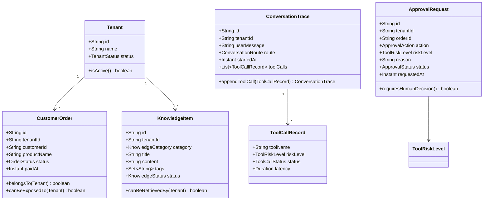

# Day 03：定义核心领域模型

## 结论

Day 03 已完成 `customer-domain` 的核心领域模型和单元测试。

今天的重点不是接数据库，也不是写 Agent，而是先把企业客服订单平台的业务语言固定下来：

- `Tenant` 是租户隔离边界。
- `CustomerOrder` 是订单查询的只读业务事实。
- `KnowledgeItem` 是后续 RAG 的知识归属和启停边界。
- `ConversationTrace` 是 Agent 决策、路由和工具调用链的审计入口。
- `ApprovalRequest` 是退款、取消、改签等高风险动作的人工审批边界。
- `ToolRiskLevel` 是 Tool Calling / MCP 权限策略的基础枚举。

当前领域对象保持纯 Java，不依赖 Spring Web、Spring AI、JPA、JDBC 或 MCP SDK。

## 今日目标

1. 在 `customer-domain` 中定义核心领域对象。
2. 用单元测试固化租户隔离、只读订单查询、知识条目启停、trace 追加和审批边界。
3. 保持领域层与持久化、接口层、模型调用层解耦。
4. 为 Day 04 的基础 REST API 提供可复用的领域类型。

## 业务场景

### 租户内订单查询

用户问：

```text
查询订单 order-1001 什么时候开课？
```

领域判断：

- 订单必须属于当前租户。
- 租户必须处于启用状态。
- 订单查询属于只读能力，不触发审批。

### 知识库检索

用户问：

```text
新手适合学习这门课程吗？
```

领域判断：

- 只允许检索当前租户的知识条目。
- 只允许检索启用状态的知识条目。
- FAQ、政策、产品知识先用 `KnowledgeCategory` 区分。

### 退款或取消订单

用户问：

```text
我要退款。
```

领域判断：

- 退款、取消、改签属于高风险动作。
- 模型或工具不能直接执行真实写操作。
- 系统只能创建 `ApprovalRequest`，等待人工审批。

### 对话审计和调试

每次 Agent 请求都需要可解释：

- 走了哪个路由。
- 调用了哪些工具。
- 工具风险级别是什么。
- 工具耗时和执行状态是什么。

这些信息由 `ConversationTrace` 和 `ToolCallRecord` 表达。

## 模块边界

### `customer-domain` 负责

- 定义业务对象、枚举和值约束。
- 表达租户隔离、知识条目启停、工具风险和审批边界。
- 提供无框架依赖的单元测试。

### `customer-domain` 不负责

- 不暴露 HTTP API。
- 不调用 LLM。
- 不调用 MCP。
- 不访问数据库。
- 不做 RAG 切片、向量化或检索。
- 不执行真实退款、取消或改签。

## 接口设计

Day 03 的接口不是 HTTP 接口，而是领域 API。

| 类型 | 关键方法 | 用途 |
| --- | --- | --- |
| `Tenant` | `active(...)`、`isActive()` | 创建启用租户，判断是否可参与业务 |
| `CustomerOrder` | `paid(...)`、`belongsTo(...)`、`canBeExposedTo(...)` | 建模已支付订单和租户可见性 |
| `KnowledgeItem` | `enabled(...)`、`disabled(...)`、`canBeRetrievedBy(...)` | 建模知识条目的检索边界 |
| `ConversationTrace` | `started(...)`、`appendToolCall(...)` | 记录对话路由和工具调用链 |
| `ToolCallRecord` | `succeeded(...)` | 记录工具名称、风险、状态和耗时 |
| `ApprovalRequest` | `pending(...)`、`requiresHumanDecision()` | 创建待审批高风险动作 |
| `ToolRiskLevel` | `requiresApproval()` | 判断工具风险是否需要人工审批 |

## 数据模型



## 安全边界

### 租户隔离

`CustomerOrder.canBeExposedTo(Tenant)` 和 `KnowledgeItem.canBeRetrievedBy(Tenant)` 都要求：

- 租户 ID 匹配。
- 租户处于启用状态。

这只是领域层第一道边界。后续 API、Repository、RAG 和 MCP 工具仍必须重复校验租户上下文，不能只依赖前端或 Prompt。

### 高风险动作审批

`ApprovalRequest` 只允许由需要审批的 `ToolRiskLevel` 创建。

| 风险级别 | 是否需要人工审批 | 示例 |
| --- | --- | --- |
| `READ_ONLY` | 否 | 知识检索、订单查询 |
| `LOW_RISK_WRITE` | 否 | 创建人工转接记录，后续工具层可追加配置开关 |
| `HIGH_RISK` | 是 | 真实退款、真实取消、真实改签 |

Day 03 不执行高风险动作，只表达审批请求。

### Prompt Injection 防护前置

本日没有实现 Prompt，但领域层已经固定两个原则：

- RAG 知识条目只表达业务事实，不允许覆盖系统指令。
- 工具风险由 Java 枚举控制，不由模型输出自由决定。

## 测试用例

| 测试类 | 覆盖点 |
| --- | --- |
| `TenantTest` | 启用租户创建、租户 ID 必填 |
| `CustomerOrderTest` | 订单租户归属、跨租户不可见、订单 ID 必填 |
| `KnowledgeItemTest` | 启用知识条目可检索、跨租户不可检索、停用条目不可检索 |
| `ConversationTraceTest` | 追加工具调用时保持原 trace 不变 |
| `ApprovalRequestTest` | 高风险动作创建待审批请求，只读工具不能创建审批 |
| `ToolRiskLevelTest` | 风险级别和审批策略 |

## 验证方式

红灯阶段：

```bash
cd projects/enterprise-customer-service-agent
mvn -pl customer-domain test
```

预期失败原因是测试引用的领域类型尚未实现。

绿灯阶段：

```bash
cd projects/enterprise-customer-service-agent
mvn -pl customer-domain test
```

通过标准：

- `Tests run: 12`
- `Failures: 0`
- `Errors: 0`
- `Skipped: 0`

最终回归：

```bash
cd projects/enterprise-customer-service-agent
mvn test
```

用于确认 `customer-agent-app` 和 `customer-mcp-server` 仍能通过依赖编译。

## 原则应用

- KISS：领域模型只表达当前 Day 03 明确需要的业务边界。
- YAGNI：不提前引入 JPA、JDBC、Repository、数据库迁移或 Spring AI starter。
- DRY：必填文本校验集中在 `DomainText`，避免每个 record 重复判断。
- SOLID：领域对象不依赖接口层、模型层、工具协议层；后续 API 和 MCP 可以独立适配。

## 下一步

Day 04 基于这些领域模型实现基础 REST API：

- `GET /health`
- `GET /api/orders/{orderId}`
- `POST /chat`

订单数据仍使用 mock，不连接远程服务器、不执行 DDL、不调用生产 API。
