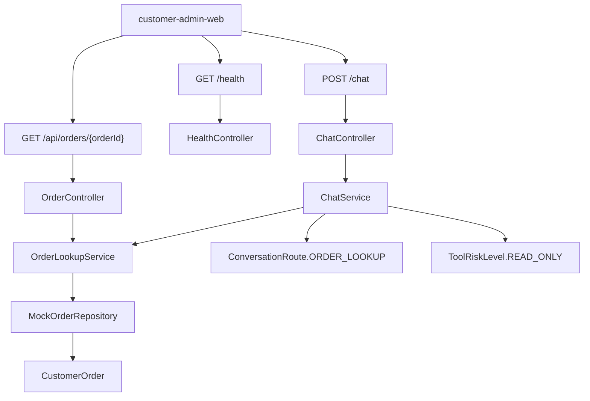

# Day 04：实现基础 REST API

## 结论

Day 04 已完成 `customer-agent-app` 的最小 REST API，并把 `customer-admin-web` 从 Day 02 的静态骨架升级为可调用基础 API 的本地调试台。

今天的目标不是接入 LLM、数据库或完整 Agent 编排，而是先建立企业客服订单平台的服务入口：

- `GET /health` 返回应用健康状态。
- `GET /api/orders/{orderId}` 返回 mock 订单。
- `POST /chat` 返回基础结构化客服响应。
- Web 调试台展示 health、订单查询和 chat 响应快照。

## 今日目标

1. 在 `customer-agent-app` 建立 Controller / Service / Repository 分层。
2. 用 mock 订单数据打通订单查询链路。
3. 为 `/chat` 返回可被调试台读取的结构化响应。
4. 在 `customer-admin-web` 中用 TanStack Query 调用基础 API。
5. 用后端集成测试和前端渲染测试固化 Day 04 行为。

## 业务场景

### 健康检查

开发者打开调试台时，需要先知道后端应用是否可用。

```http
GET /health
```

响应：

```json
{
  "status": "UP",
  "service": "customer-agent-app"
}
```

### 订单查询

用户或调试者查询订单：

```http
GET /api/orders/order-1001
```

响应：

```json
{
  "id": "order-1001",
  "tenantId": "tenant-demo",
  "customerId": "customer-1001",
  "productName": "企业级 AI Agent 实战营",
  "status": "PAID",
  "paidAt": "2026-06-01T10:00:00Z"
}
```

订单不存在时返回：

```json
{
  "errorCode": "ORDER_NOT_FOUND",
  "message": "订单不存在：missing-order"
}
```

### 基础对话

用户问：

```text
帮我查询订单 order-1001 什么时候开课
```

接口：

```http
POST /chat
Content-Type: application/json

{
  "tenantId": "tenant-demo",
  "message": "帮我查询订单 order-1001 什么时候开课"
}
```

响应结构：

```json
{
  "traceId": "trace-...",
  "route": "ORDER_LOOKUP",
  "riskLevel": "READ_ONLY",
  "reply": "已查询到订单 order-1001，课程为「企业级 AI Agent 实战营」，当前状态为 PAID。",
  "order": {
    "id": "order-1001",
    "tenantId": "tenant-demo",
    "customerId": "customer-1001",
    "productName": "企业级 AI Agent 实战营",
    "status": "PAID",
    "paidAt": "2026-06-01T10:00:00Z"
  },
  "nextActions": [
    "展示订单状态",
    "等待用户继续追问"
  ]
}
```

## 模块边界

### `customer-agent-app` 负责

- 暴露 HTTP API。
- 编排基础应用服务。
- 使用 mock 仓库查询订单。
- 把领域模型转换为 API 响应。
- 为 Web 调试台提供结构化响应。

### `customer-agent-app` 不负责

- 不访问真实数据库。
- 不调用真实 LLM。
- 不调用 MCP Server。
- 不执行退款、取消、改签等高风险动作。
- 不实现完整全局异常体系，Day 05 再统一收敛。

### `customer-admin-web` 负责

- 提供本地开发调试入口。
- 展示 health、订单和 chat 响应快照。
- 用 TanStack Query 封装 API 调用。
- 通过 Vite dev proxy 转发 `/health`、`/api` 和 `/chat` 到 `customer-agent-app`。

### `customer-admin-web` 不负责

- 不做完整运营后台。
- 不做权限、租户或 BI 管理。
- 不替代 Grafana 运行态监控台。

## 分层设计



## 接口设计

| 接口 | Controller | 主要用途 |
| --- | --- | --- |
| `GET /health` | `HealthController` | 调试台联通性验证 |
| `GET /api/orders/{orderId}` | `OrderController` | 查询 mock 订单 |
| `POST /chat` | `ChatController` | 返回基础结构化客服响应 |

## 数据模型

| 类型 | 所在模块 | 用途 |
| --- | --- | --- |
| `CustomerOrder` | `customer-domain` | 订单领域事实 |
| `OrderResponse` | `customer-agent-app` | 订单 API 响应 |
| `ChatRequest` | `customer-agent-app` | 对话请求 |
| `ChatResponse` | `customer-agent-app` | 对话响应 |
| `HealthResponse` | `customer-agent-app` | 健康检查响应 |
| `ApiErrorResponse` | `customer-agent-app` | 基础错误响应 |

## 安全边界

- 当前订单数据是本地 mock，不连接远程数据库或生产 API。
- `/chat` 只返回只读订单查询结果，风险级别固定为 `READ_ONLY`。
- 当前 API 面向本地开发调试，尚未接入 Spring Security 或租户鉴权；生产化访问控制在后续多租户与安全阶段实现。
- 高风险动作仍禁止默认执行；退款、取消、改签后续必须进入人工审批。
- Day 04 不保存密钥、token、数据库密码或远程服务器真实值。

## 测试用例

| 测试 | 覆盖点 |
| --- | --- |
| `CustomerAgentApiTest.shouldReturnApplicationHealth` | `/health` 返回 `UP` 和服务名 |
| `CustomerAgentApiTest.shouldReturnMockOrderById` | `/api/orders/order-1001` 返回 mock 订单 |
| `CustomerAgentApiTest.shouldReturnNotFoundForMissingOrder` | 订单不存在返回 404 和 `ORDER_NOT_FOUND` |
| `CustomerAgentApiTest.shouldReturnStructuredChatResponse` | `/chat` 返回 route、riskLevel、traceId、订单证据和 nextActions |
| `App.test.tsx` | 调试台渲染 health、订单和 chat 响应快照 |

## 验证方式

红灯阶段：

```bash
cd projects/enterprise-customer-service-agent
mvn -pl customer-agent-app -am test -Dtest=CustomerAgentApiTest -Dsurefire.failIfNoSpecifiedTests=false
```

预期失败：

- `/health`、`/api/orders/{orderId}`、`/chat` 都返回 404。

绿灯阶段：

```bash
cd projects/enterprise-customer-service-agent
mvn -pl customer-agent-app -am test -Dtest=CustomerAgentApiTest -Dsurefire.failIfNoSpecifiedTests=false
```

通过标准：

- `Tests run: 4`
- `Failures: 0`
- `Errors: 0`
- `Skipped: 0`

最终回归：

```bash
cd projects/enterprise-customer-service-agent
mvn test

cd customer-admin-web
npm test
npm run build
```

本地联调：

```bash
cd projects/enterprise-customer-service-agent
mvn -pl customer-agent-app -am package -DskipTests
java -jar customer-agent-app/target/customer-agent-app-0.1.0-SNAPSHOT.jar

cd customer-admin-web
npm run dev
```

本次验证结果：

- Maven 全模块测试通过。
- 前端 Vitest 通过。
- 前端生产构建通过。
- Vite 提示 Ant Design 打包 chunk 超过 500 kB，属于当前单页调试台可接受的构建警告。

## 原则应用

- KISS：REST API 只覆盖 Day 04 明确要求的 health、订单查询和基础 chat。
- YAGNI：没有提前接 PostgreSQL、Redis、Spring AI ChatClient、MCP 或复杂 Agent 编排。
- DRY：订单查询由 `OrderLookupService` 统一封装，`/chat` 和订单 API 复用同一查询入口。
- SOLID：Controller 只处理 HTTP 入口，Service 处理应用逻辑，Repository 隔离 mock 数据来源，领域对象仍在 `customer-domain`。
