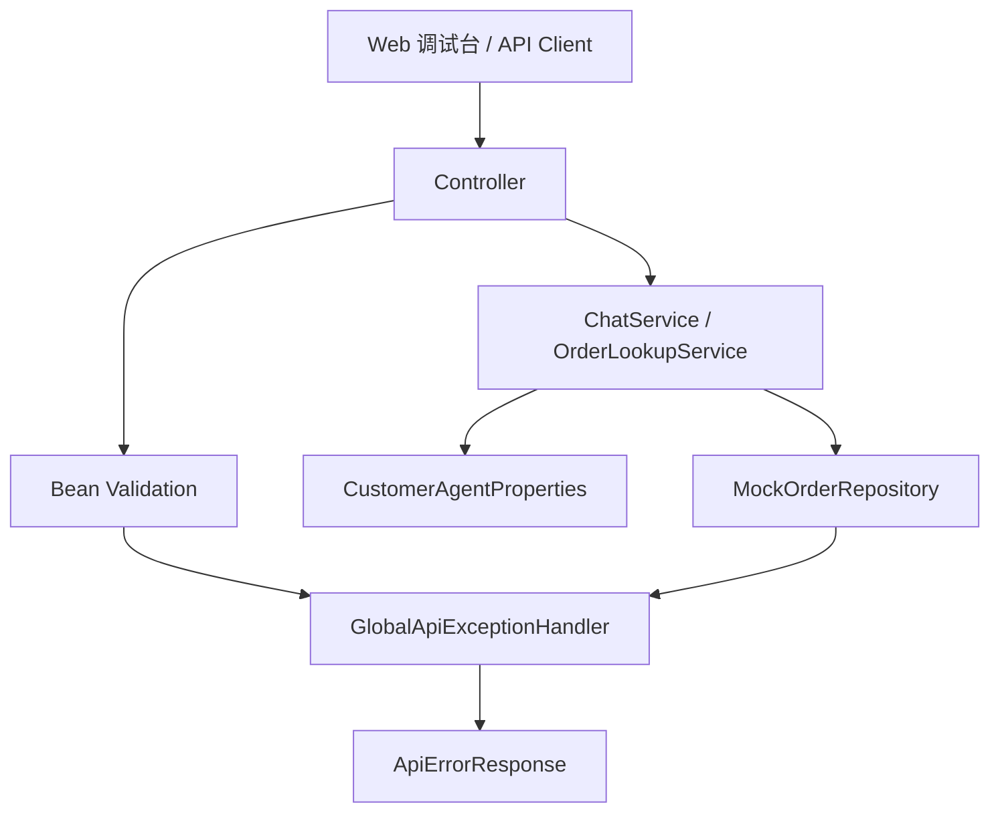

# Day 05：配置、错误处理与基础测试

## 结论

Day 05 已补齐阶段 1 的工程基础设施：`customer-agent-app` 现在具备集中配置、请求参数校验、统一错误响应和覆盖这些行为的 API 测试。

今天仍然不接入 LLM、数据库、Redis、MCP 或远程服务。目标是先让 Day 04 的基础 API 变成可维护、可调试、可回归的 Spring Boot 服务入口。

## 今日目标

1. 用 `application.yml` 管理本地调试默认值。
2. 用 `@ConfigurationProperties` 建立类型安全配置边界。
3. 用 Bean Validation 拦截无效请求。
4. 用 `@RestControllerAdvice` 统一 API 错误结构。
5. 用集成测试覆盖配置绑定、404 和 400 错误响应。

## 业务场景

### 默认订单查询

当前 `/chat` 仍是确定性规则，不调用模型。用户消息中未出现订单号时，服务使用配置中的默认订单演示本地调试链路。

```yaml
customer-agent:
  default-order-id: order-1001
  trace-id-prefix: trace
```

这两个值只服务本地 MVP 调试，不代表生产真实订单或正式 trace 方案。

### 订单不存在

```http
GET /api/orders/missing-order
```

统一错误响应：

```json
{
  "timestamp": "2026-06-27T02:34:17.000Z",
  "status": 404,
  "errorCode": "ORDER_NOT_FOUND",
  "message": "订单不存在：missing-order",
  "path": "/api/orders/missing-order",
  "traceId": "trace-..."
}
```

### 对话请求校验失败

```http
POST /chat
Content-Type: application/json

{
  "tenantId": "tenant-demo",
  "message": " "
}
```

统一错误响应：

```json
{
  "timestamp": "2026-06-27T02:34:17.000Z",
  "status": 400,
  "errorCode": "VALIDATION_ERROR",
  "message": "message: message 不能为空",
  "path": "/chat",
  "traceId": "trace-..."
}
```

## 模块边界

### `customer-agent-app` 负责

- HTTP 请求参数校验。
- 应用级配置绑定。
- 本地调试默认值管理。
- API 错误结构统一。
- 为后续调试台、trace、日志审计提供错误定位字段。

### `customer-agent-app` 不负责

- 不保存模型 API Key、数据库密码或远程服务器真实值。
- 不连接远程开发服务器。
- 不访问真实数据库。
- 不实现完整 Spring Security 权限体系。
- 不把高风险业务动作做成自动执行。

## 分层设计



## 接口设计

| 行为 | 状态码 | 错误码 | 说明 |
| --- | --- | --- | --- |
| 订单不存在 | `404` | `ORDER_NOT_FOUND` | `OrderNotFoundException` 统一转换 |
| 参数校验失败 | `400` | `VALIDATION_ERROR` | `@NotBlank` 和 `@Valid` 触发 |

错误响应统一字段：

| 字段 | 用途 |
| --- | --- |
| `timestamp` | 错误发生时间 |
| `status` | HTTP 状态码 |
| `errorCode` | 前端和测试可稳定判断的错误码 |
| `message` | 面向开发调试的错误说明 |
| `path` | 触发错误的请求路径 |
| `traceId` | 后续关联日志、trace 和调试台的标识 |

## 数据模型

| 类型 | 所在层 | 职责 |
| --- | --- | --- |
| `CustomerAgentProperties` | config | 绑定 `customer-agent.default-order-id` 和 `customer-agent.trace-id-prefix` |
| `ChatRequest` | chat | 声明 `/chat` 请求字段和校验规则 |
| `ApiErrorResponse` | api | 统一 API 错误响应 |
| `GlobalApiExceptionHandler` | api | 统一异常到 HTTP 响应的转换 |

## 安全边界

- `application.yml` 只保存非敏感默认值。
- 敏感配置后续必须通过环境变量、Secret 或远程 `.env` 注入，不写入仓库。
- 错误响应不回显密钥、token、数据库连接串或堆栈。
- `traceId` 只用于关联调试信息，不承载用户隐私。
- 当前参数校验只覆盖 Day 05 明确需要的 `tenantId` 和 `message`，租户鉴权留到多租户安全阶段。

## 测试用例

| 测试 | 覆盖点 |
| --- | --- |
| `shouldBindCustomerAgentProperties` | `customer-agent.*` 配置绑定 |
| `shouldReturnApplicationHealth` | `/health` 基础健康检查 |
| `shouldReturnMockOrderById` | mock 订单查询 |
| `shouldReturnNotFoundForMissingOrder` | 404 统一错误响应 |
| `shouldReturnStructuredChatResponse` | `/chat` 结构化响应 |
| `shouldRejectBlankChatMessage` | 400 参数校验错误响应 |

## 验证方式

红灯阶段：

```bash
cd projects/enterprise-customer-service-agent
mvn -pl customer-agent-app -am test -Dtest=CustomerAgentApiTest -Dsurefire.failIfNoSpecifiedTests=false
```

预期失败：

- `CustomerAgentProperties` 不存在，测试编译失败。

绿灯阶段：

```bash
cd projects/enterprise-customer-service-agent
mvn -pl customer-agent-app -am test -Dtest=CustomerAgentApiTest -Dsurefire.failIfNoSpecifiedTests=false
```

通过标准：

- `CustomerAgentApiTest`
- `Tests run: 6`
- `Failures: 0`
- `Errors: 0`
- `Skipped: 0`

阶段 1 回归：

```bash
cd projects/enterprise-customer-service-agent
mvn test

cd customer-admin-web
npm test
npm run build
```

## 原则应用

- KISS：只引入 Spring Boot validation，配置项只保留当前生产路径使用的默认订单和 trace 前缀。
- YAGNI：不提前做配置中心、Secret 管理平台、完整异常码体系或安全认证。
- DRY：`ChatService` 不再硬编码默认订单和 trace 前缀，统一从 `CustomerAgentProperties` 读取。
- SOLID：配置、请求模型、业务服务和异常转换各自保持单一职责；后续新增异常类型时扩展 `GlobalApiExceptionHandler`，不需要修改 Controller。
