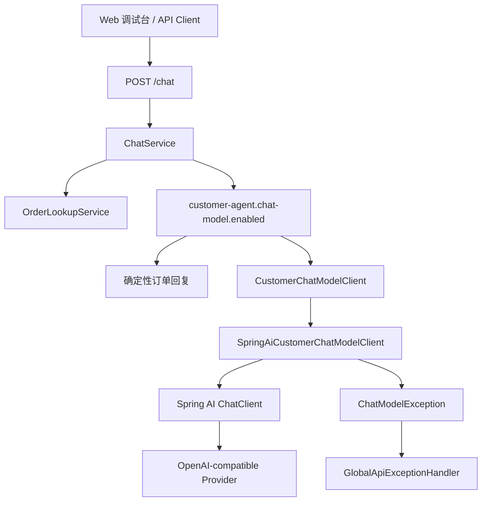

# Day 06：接入 Spring AI ChatClient

## 结论

Day 06 已进入阶段 2，完成 `customer-agent-app` 的最小 Spring AI `ChatClient` 接入边界。

今天没有把客服回复完全交给模型，也没有引入复杂 Agent 编排。当前实现只做一件事：在原有订单查询证据已经确定的前提下，允许通过配置把最终回复生成切换到 Spring AI `ChatClient`，并把模型异常包装为稳定的业务错误。

## 今日目标

1. 引入 Spring AI OpenAI-compatible starter。
2. 增加 `CustomerChatModelClient` 业务接口，隔离 Spring AI 细节。
3. 增加 DeepSeek 默认配置入口，并保留 OpenAI-compatible 覆盖能力。
4. 在模型未启用时保留 Day 04 的确定性回复。
5. 覆盖模型启用、模型禁用和模型异常三个测试场景。

## 业务场景

### 默认本地调试

默认配置不调用外部模型：

```yaml
spring:
  ai:
    model:
      chat: ${SPRING_AI_MODEL_CHAT:none}

customer-agent:
  chat-model:
    enabled: ${CUSTOMER_AGENT_CHAT_MODEL_ENABLED:false}
```

这种模式适合本地开发和 CI。`POST /chat` 仍返回确定性订单回复，不需要 API Key，不访问外网。

### 启用真实模型

启用模型时需要同时打开 Spring AI chat model 和业务开关。建议把这些值写在主工程目录的本地 `.env` 文件中：

```bash
SPRING_AI_MODEL_CHAT=openai
CUSTOMER_AGENT_CHAT_MODEL_ENABLED=true
SPRING_AI_OPENAI_API_KEY=<your-deepseek-api-key>
SPRING_AI_OPENAI_BASE_URL=https://api.deepseek.com
SPRING_AI_OPENAI_CHAT_MODEL=deepseek-v4-flash
SPRING_AI_OPENAI_CHAT_TEMPERATURE=0.2
```

项目默认按 DeepSeek 配置：

```yaml
spring:
  ai:
    openai:
      base-url: ${SPRING_AI_OPENAI_BASE_URL:https://api.deepseek.com}
      chat:
        model: ${SPRING_AI_OPENAI_CHAT_MODEL:deepseek-v4-flash}
```

DeepSeek 走 Spring AI 的 OpenAI-compatible 通道，所以配置名仍是 `spring.ai.openai.*`。其他 OpenAI-compatible provider 只需要覆盖 `base-url`、`api-key` 和 `model`。密钥只允许通过本地 `.env`、环境变量或 Secret 注入，不写入仓库。

### 模型调用失败

模型超时、网络失败、空响应或 provider 异常会被包装为：

```json
{
  "status": 502,
  "errorCode": "CHAT_MODEL_ERROR",
  "message": "模型调用失败",
  "path": "/chat",
  "traceId": "trace-..."
}
```

## 模块边界

### `customer-agent-app` 负责

- 暴露 Spring AI ChatClient 的最小业务适配。
- 把订单事实整理为模型输入上下文。
- 控制是否启用真实模型调用。
- 将模型异常转换为统一 API 错误结构。

### `customer-agent-app` 不负责

- 不保存模型 API Key。
- 不在默认测试中调用外部模型。
- 不让模型决定是否查询订单；当前订单查询仍由确定性服务完成。
- 不实现 Tool Calling、RAG、Memory 或多 Agent 编排。
- 不执行退款、取消、改签等高风险动作。

## 分层设计



核心设计点：

- `ChatService` 只依赖 `CustomerChatModelClient`，不直接依赖 Spring AI。
- `SpringAiCustomerChatModelClient` 是基础设施适配层，负责拼接 system/user prompt 并调用 `ChatClient`。
- `DisabledCustomerChatModelClient` 保证本地默认配置下 Bean 可用，但误调用会快速失败。

## 接口设计

`/chat` 请求结构保持不变：

```http
POST /chat
Content-Type: application/json

{
  "tenantId": "tenant-demo",
  "message": "帮我查询订单 order-1001 什么时候开课"
}
```

响应结构也保持不变：

```json
{
  "traceId": "trace-...",
  "route": "ORDER_LOOKUP",
  "riskLevel": "READ_ONLY",
  "reply": "模型或确定性服务生成的客服回复",
  "order": {
    "id": "order-1001",
    "productName": "企业级 AI Agent 实战营",
    "status": "PAID"
  },
  "nextActions": [
    "展示订单状态",
    "等待用户继续追问"
  ]
}
```

Day 06 的重点是替换 `reply` 的生成来源，不改变前端和 API 调用方的结构化契约。

## 数据模型

| 类型 | 所在层 | 职责 |
| --- | --- | --- |
| `CustomerChatModelClient` | chat | 客服模型调用业务接口 |
| `CustomerChatPrompt` | chat | 传给模型的租户、用户问题和订单证据 |
| `SpringAiCustomerChatModelClient` | chat / infrastructure | Spring AI `ChatClient` 适配 |
| `DisabledCustomerChatModelClient` | chat / infrastructure | 未启用模型时的安全占位 |
| `ChatModelException` | chat | 模型调用业务异常 |
| `CustomerAgentProperties.ChatModel` | config | `customer-agent.chat-model.enabled` 配置 |

## 安全边界

- `SPRING_AI_OPENAI_API_KEY` 只能通过环境变量或 Secret 注入。
- `application.yml` 只保存空默认值和非敏感配置。
- 默认 `CUSTOMER_AGENT_CHAT_MODEL_ENABLED=false`，避免本地测试误调用外部模型。
- 模型只接收当前订单证据和用户问题，不接收密钥、数据库连接串或服务器真实配置。
- 模型输出只用于客服回复文案；订单事实、路由和风险级别仍由 Java 侧控制。

## 测试用例

| 测试 | 覆盖点 |
| --- | --- |
| `shouldUseConfiguredChatModelClientWhenEnabled` | 开启模型时 `ChatService` 调用模型接口，并传入订单证据 |
| `shouldFallbackToDeterministicReplyWhenChatModelDisabled` | 关闭模型时不调用模型，继续返回确定性订单回复 |
| `shouldWrapModelFailureAsBusinessException` | 模型异常被包装为 `ChatModelException` |
| `CustomerAgentApiTest.shouldReturnStructuredChatResponse` | API 结构兼容 Day 04 / Day 05 调试台契约 |

## 验证方式

红灯阶段：

```bash
cd projects/enterprise-customer-service-agent
mvn -pl customer-agent-app -Dtest=ChatServiceModelClientTest test
```

预期失败：

- `CustomerChatModelClient`、`CustomerChatPrompt` 等 Day 06 类型不存在，测试编译失败。

绿灯阶段：

```bash
cd projects/enterprise-customer-service-agent
mvn -pl customer-agent-app -Dtest=ChatServiceModelClientTest test
```

通过标准：

- `Tests run: 3`
- `Failures: 0`
- `Errors: 0`
- `Skipped: 0`

阶段回归：

```bash
cd projects/enterprise-customer-service-agent
mvn test

cd customer-admin-web
npm test
npm run build
```

## 原则应用

- KISS：只接入 ChatClient 的最小回复生成能力，不提前设计完整 Agent Loop。
- YAGNI：不引入 Tool Calling、RAG、Memory、多 Agent 或真实订单数据库。
- DRY：模型调用统一收口到 `CustomerChatModelClient`，后续 Prompt、重试和观测都从这一层扩展。
- SOLID：`ChatService` 负责业务编排，Spring AI 适配器负责外部模型调用，异常处理器负责 HTTP 错误转换。
