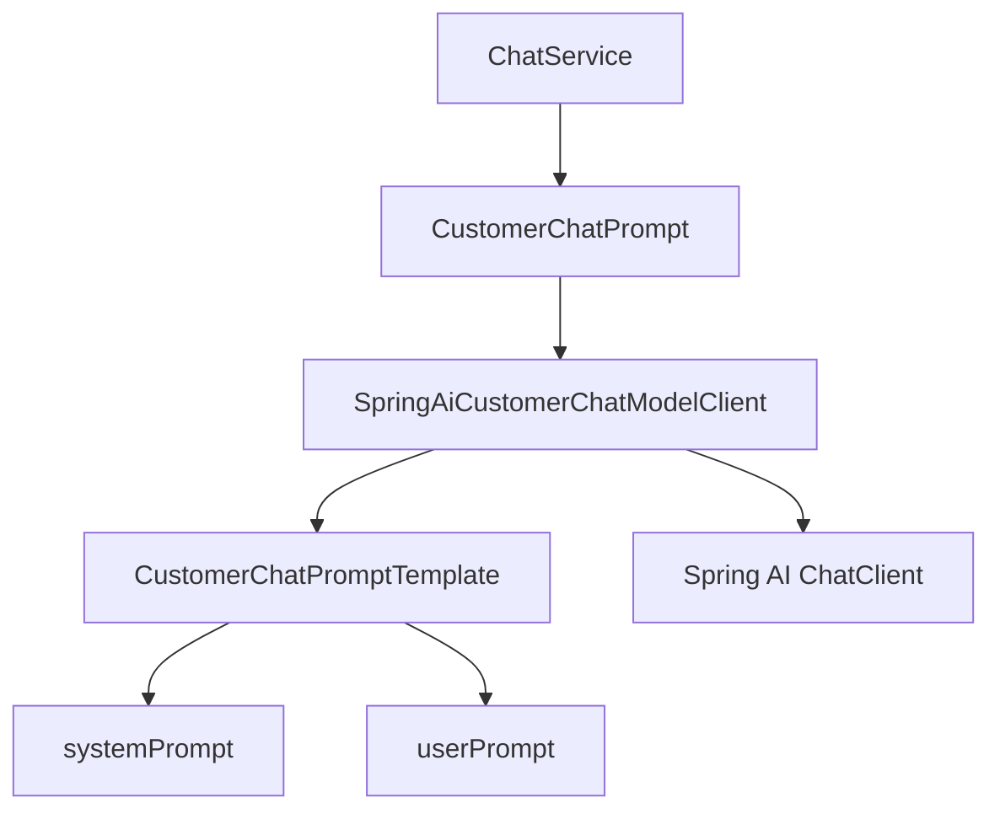

# Day 07：设计客服 Agent Prompt

## 结论

Day 07 把客服 Agent 的 Prompt 从模型适配器中的硬编码文本，收敛成可版本化、可测试的行为契约。

今天不做意图识别、结构化输出解析、Tool Calling、RAG 或真实审批执行。当前只解决一个问题：模型在生成客服回复时，必须清楚知道哪些事能说、哪些事不能承诺、业务事实必须来自哪里。

## 今日目标

1. 定义客服 Agent 的系统 Prompt 行为契约。
2. 给 Prompt 增加稳定版本号。
3. 把 Prompt 渲染逻辑从 `SpringAiCustomerChatModelClient` 中抽出。
4. 用单元测试锁定 Prompt 中不能写死具体业务事实。
5. 保持 Day 06 的模型调用边界不变。

## 业务场景

### 订单状态问答

用户问：

```text
帮我查询订单 order-1001 什么时候开课
```

模型只能基于 Java 层传入的订单证据回答，不能自行推断开课时间、支付状态或履约状态。当前订单查询仍由 `OrderLookupService` 完成，模型只负责组织客服回复文案。

### 退款、取消或改签

用户问：

```text
我想退款，这个订单能直接退吗？
```

Prompt 必须约束模型：

- 不承诺真实退款成功。
- 不假装已经执行取消、改签或退款。
- 高风险动作必须进入审批。
- 证据不足时提示继续确认或转人工。

### 业务事实来源

模型可以使用的事实来源只有三类：

| 来源 | 当前状态 | 说明 |
| --- | --- | --- |
| 工具证据 | 当前已有订单查询证据 | Day 11 后扩展为 Tool Calling |
| 知识库证据 | 当前未接入 | Day 16 后扩展为 RAG |
| 用户输入 | 当前已有用户问题 | 只能作为用户意图和上下文，不可当作已验证事实 |

## 模块边界

### `customer-agent-app` 负责

- 维护客服 Agent Prompt 版本号。
- 维护系统行为契约。
- 渲染传给模型的用户 Prompt。
- 在单元测试中验证 Prompt 不包含具体订单样例事实。

### `customer-agent-app` 不负责

- 不让模型决定是否查询订单。
- 不让模型执行退款、取消或改签。
- 不实现 Day 08 的意图识别。
- 不实现 Day 09 的结构化输出解析。
- 不接入 Day 16 之后的 RAG 知识库。

## 分层设计



设计点：

- `CustomerChatPrompt` 只携带运行时上下文：租户、用户问题和订单证据。
- `CustomerChatPromptTemplate` 只负责 Prompt 版本和文本契约。
- `SpringAiCustomerChatModelClient` 只负责调用 Spring AI `ChatClient`。

## 接口设计

### Prompt 版本

```java
String version()
```

当前返回：

```text
customer-agent-prompt-v1
```

版本号用于后续 trace、eval 和调试台展示，避免无法判断一次模型回复使用的是哪版行为契约。

### 系统 Prompt

```java
String systemPrompt()
```

系统 Prompt 只描述行为边界，不写死订单号、课程名、支付状态或任何样例业务事实。

核心约束：

- 不得编造订单状态、履约进度、课程时间、退款结果或未提供的业务事实。
- 不得承诺真实退款成功、真实取消订单成功或真实改签成功。
- 必须基于工具、知识库或用户输入证据生成回复。
- 高风险动作必须进入审批。
- 回复保持简洁、专业，并给出下一步建议。

### 用户 Prompt

```java
String userPrompt(CustomerChatPrompt prompt)
```

用户 Prompt 只拼接运行时上下文：

```text
Prompt 版本：customer-agent-prompt-v1
租户：tenant-demo
用户问题：帮我查询订单 order-1001 什么时候开课
事实证据：订单 order-1001，课程「企业级 AI Agent 实战营」，状态 PAID
```

## 数据模型

| 类型 | 所在层 | 职责 |
| --- | --- | --- |
| `CustomerChatPromptTemplate` | chat | Prompt 版本、系统 Prompt、用户 Prompt 渲染 |
| `CustomerChatPrompt` | chat | 运行时 Prompt 上下文 |
| `SpringAiCustomerChatModelClient` | chat / infrastructure | 调用 Spring AI `ChatClient` |
| `CustomerChatModelClient` | chat | 模型调用业务接口 |

## 安全边界

- Prompt 中不写入密钥、token、数据库连接串或远程服务器信息。
- Prompt 中不写死具体订单 ID、课程名、支付状态或履约结果。
- 模型输出不能改变 Java 层确定的 `route`、`riskLevel`、`order` 和 `nextActions`。
- 高风险动作只能被描述为需要审批，不能被描述为已经执行。
- 后续 RAG 文档中的指令性文本不能覆盖系统 Prompt。

## 测试用例

| 测试 | 覆盖点 |
| --- | --- |
| `CustomerChatPromptTemplateTest.shouldExposeVersionedCustomerServicePromptContract` | Prompt 版本和核心行为契约 |
| `CustomerChatPromptTemplateTest.shouldKeepBusinessFactsOutOfSystemPrompt` | 系统 Prompt 不写死订单样例事实 |
| `CustomerChatPromptTemplateTest.shouldRenderUserPromptWithRuntimeEvidenceOnly` | 用户 Prompt 只包含运行时证据 |

## 验证方式

红灯阶段：

```bash
cd projects/enterprise-customer-service-agent
mvn -pl customer-agent-app -am -Dtest=CustomerChatPromptTemplateTest -Dsurefire.failIfNoSpecifiedTests=false test
```

预期失败：

- `CustomerChatPromptTemplate` 不存在，测试编译失败。

绿灯阶段：

```bash
cd projects/enterprise-customer-service-agent
mvn -pl customer-agent-app -am -Dtest=CustomerChatPromptTemplateTest -Dsurefire.failIfNoSpecifiedTests=false test
```

通过标准：

- `CustomerChatPromptTemplateTest`
- `Tests run: 3`
- `Failures: 0`
- `Errors: 0`
- `Skipped: 0`

阶段 2 当前回归：

```bash
cd projects/enterprise-customer-service-agent
mvn -pl customer-agent-app -am test -Dsurefire.failIfNoSpecifiedTests=false
```

## 原则应用

- KISS：只抽出 Prompt 模板和版本号，不引入 Prompt 管理平台或复杂模板引擎。
- YAGNI：不提前实现意图识别、结构化输出解析、Tool Calling、RAG 或审批工作流。
- DRY：系统 Prompt 只保留在 `CustomerChatPromptTemplate`，模型适配器不再维护重复文本。
- SOLID：Prompt 模板负责行为契约，模型适配器负责外部调用，业务服务负责订单证据编排。
