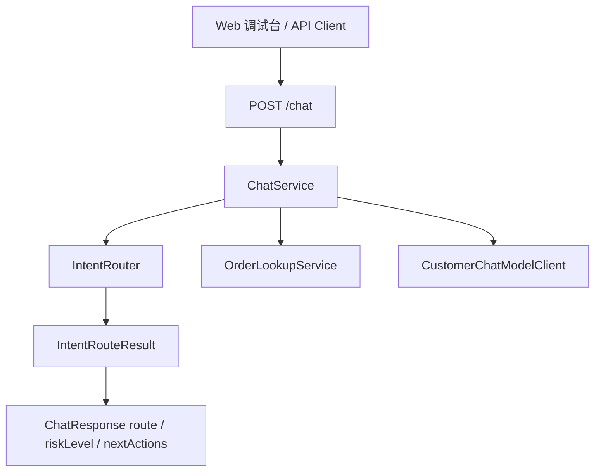

# Day 08：实现意图识别

## 结论

Day 08 已在 `customer-agent-app` 中补齐最小意图识别能力：`/chat` 不再固定返回 `ORDER_LOOKUP`，而是先经过 `IntentRouter` 分流到知识问答、订单查询、退款/取消/改签、人工转接或普通直接回复。

今天没有把意图识别交给模型，也没有实现 RAG、Tool Calling、真实退款、真实取消或真实人工工单。当前只做确定性关键词 fallback，保证模型不可用时仍有稳定路由。

## 今日目标

1. 定义 `IntentRouter` 作为客服意图识别边界。
2. 定义结构化意图输出对象 `IntentRouteResult`。
3. 覆盖五类基础意图：
   - `KNOWLEDGE_QA`
   - `ORDER_LOOKUP`
   - `REFUND_OR_CANCEL`
   - `HUMAN_HANDOFF`
   - `DIRECT`
4. 把 `/chat` 响应中的 `route`、`riskLevel`、`order` 和 `nextActions` 接到路由结果。
5. 保持 Day 06 / Day 07 的模型调用和 Prompt 契约边界不被扩大。

## 业务场景

### 知识问答

用户问：

```text
新手适合学企业级 AI Agent 课程吗？
```

系统识别为：

```text
KNOWLEDGE_QA
```

当前返回等待 RAG 接入的说明，不编造课程 FAQ 或政策答案。

### 订单查询

用户问：

```text
帮我查询订单 order-1001 什么时候开课
```

系统识别为：

```text
ORDER_LOOKUP
```

当前仍使用 mock 订单证据返回结构化订单信息。配置启用模型时，也只在订单查询场景调用 `CustomerChatModelClient` 生成回复文案。

### 退款、取消或改签

用户问：

```text
订单 order-1001 可以退款吗？
```

系统识别为：

```text
REFUND_OR_CANCEL
```

风险级别返回：

```text
HIGH_RISK
```

系统只提示进入人工审批前置判断，不执行真实退款、取消或改签。

### 人工转接

用户问：

```text
我要转人工客服
```

系统识别为：

```text
HUMAN_HANDOFF
```

当前只返回人工转接意向，不创建外部工单。真正低风险写工具留到 Day 13。

## 模块边界

### `customer-agent-app` 负责

- 根据用户消息做本地确定性意图 fallback。
- 从消息中提取 `order-xxxx` 形式的订单号。
- 为 `/chat` 响应输出稳定的 `route`、`riskLevel` 和 `nextActions`。
- 只在订单查询和携带订单号的退款/取消/改签场景读取订单证据。

### `customer-agent-app` 不负责

- 不让模型执行路由决策。
- 不执行真实退款、取消、改签。
- 不创建真实人工客服工单。
- 不回答未接入知识库的业务事实。
- 不实现 Tool Calling、MCP、RAG 或多 Agent 编排。

## 分层设计



设计点：

- `IntentRouter` 只负责意图判断，不调用模型、不查订单、不写 trace。
- `IntentRouteResult` 是结构化输出对象，只承载路由、订单号、置信度和原因。
- `ChatService` 负责业务编排：根据 route 决定是否查订单、是否允许模型生成回复、如何返回风险级别。

## 接口设计

`POST /chat` 请求结构不变：

```json
{
  "tenantId": "tenant-demo",
  "message": "订单 order-1001 可以退款吗？"
}
```

Day 08 后响应示例：

```json
{
  "traceId": "trace-refund-intent-test",
  "route": "REFUND_OR_CANCEL",
  "riskLevel": "HIGH_RISK",
  "reply": "已识别到退款、取消或改签诉求，不能直接执行退款或取消操作，后续必须进入人工审批前置判断。",
  "order": {
    "id": "order-1001",
    "productName": "企业级 AI Agent 实战营",
    "status": "PAID"
  },
  "nextActions": [
    "进入人工审批前置判断",
    "禁止直接执行退款、取消或改签"
  ]
}
```

## 数据模型

| 类型 | 所在层 | 职责 |
| --- | --- | --- |
| `IntentRouter` | intent | 本地确定性意图识别 fallback |
| `IntentRouteResult` | intent | 意图结构化输出对象 |
| `ConversationRoute` | domain / trace | 路由枚举，覆盖五类客服入口 |
| `ChatService` | chat | 消费路由结果并生成结构化客服响应 |

## 安全边界

- `REFUND_OR_CANCEL` 固定返回 `HIGH_RISK`，不执行真实业务动作。
- `HUMAN_HANDOFF` 固定返回 `LOW_RISK_WRITE`，当前只记录意向，不创建工单。
- 模型只在 `ORDER_LOOKUP` 场景被调用，避免把高风险动作交给模型文案驱动。
- 关键词 fallback 只用于本地 MVP 路由，不作为生产风控依据。
- 知识问答在 RAG 未接入前不编造课程 FAQ 或政策事实。

## 测试用例

| 测试 | 覆盖点 |
| --- | --- |
| `IntentRouterTest.shouldRouteKnowledgeQuestionToKnowledgeQa` | 知识问答路由 |
| `IntentRouterTest.shouldRouteOrderQuestionToOrderLookupAndExtractOrderId` | 订单查询和订单号提取 |
| `IntentRouterTest.shouldPreferRefundOrCancelOverOrderLookupWhenMessageContainsBoth` | 退款/取消优先级高于订单查询 |
| `IntentRouterTest.shouldRouteHumanHandoffRequestToHumanHandoff` | 人工转接路由 |
| `IntentRouterTest.shouldFallbackUnknownMessageToDirect` | 未知问题 fallback |
| `ChatServiceModelClientTest.shouldExposeRefundOrCancelIntentWithoutExecutingRiskyAction` | 高风险路由不执行真实动作 |
| `CustomerAgentApiTest.shouldReturnRefundOrCancelRouteFromChatResponse` | HTTP 响应暴露高风险意图 |

## 验证方式

红灯阶段：

```bash
cd projects/enterprise-customer-service-agent
mvn -pl customer-agent-app -am -Dtest=IntentRouterTest -Dsurefire.failIfNoSpecifiedTests=false test
```

预期失败：

- `IntentRouter` 不存在，测试编译失败。

绿灯阶段：

```bash
cd projects/enterprise-customer-service-agent
mvn -pl customer-agent-app -am -Dtest=IntentRouterTest -Dsurefire.failIfNoSpecifiedTests=false test
mvn -pl customer-agent-app -am -Dtest=ChatServiceModelClientTest -Dsurefire.failIfNoSpecifiedTests=false test
mvn -pl customer-agent-app -am -Dtest=CustomerAgentApiTest -Dsurefire.failIfNoSpecifiedTests=false test
```

阶段 2 当前回归：

```bash
cd projects/enterprise-customer-service-agent
mvn -pl customer-agent-app -am test -Dsurefire.failIfNoSpecifiedTests=false
```

## 原则应用

- KISS：先用关键词 fallback 覆盖五类客服入口，不引入模型路由或规则引擎。
- YAGNI：不提前实现 RAG、Tool Calling、人工工单、退款审批流或多 Agent。
- DRY：订单号提取统一收敛到 `IntentRouter`，`ChatService` 不再维护重复正则。
- SOLID：`IntentRouter` 负责路由判断，`ChatService` 负责业务编排，`OrderLookupService` 负责订单读取，模型适配器只负责回复文案生成。
