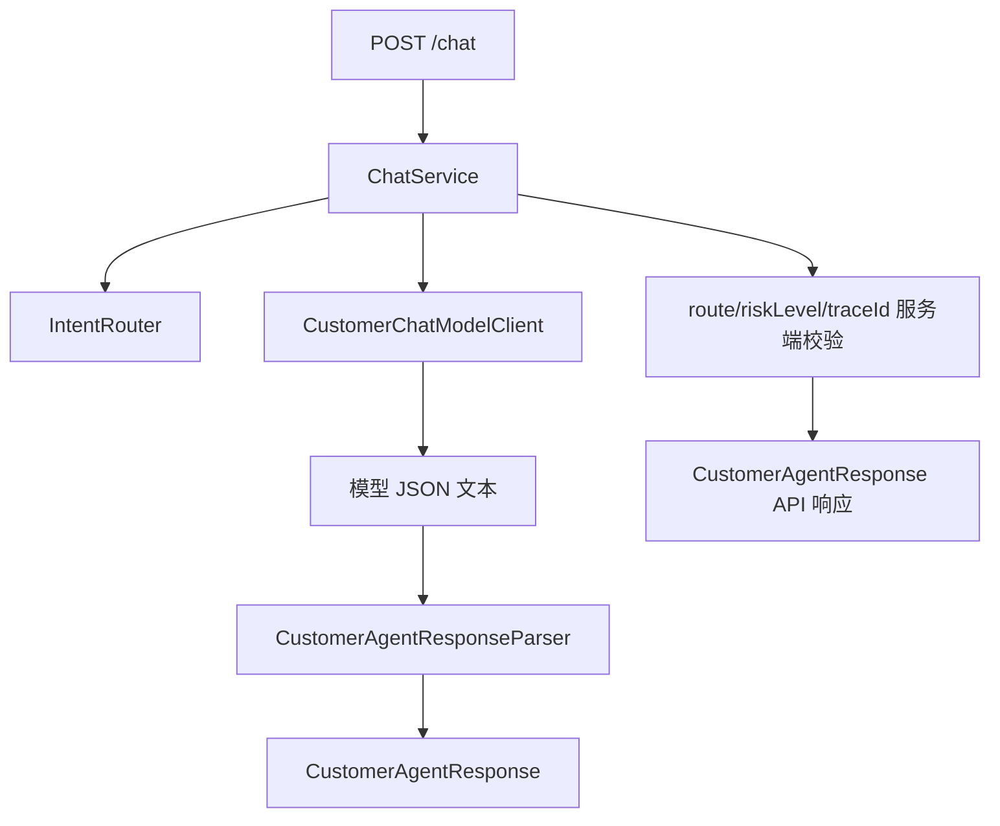

# Day 09：实现结构化客服回复

## 结论

Day 09 已把客服 Agent 输出统一为 `CustomerAgentResponse`，`/chat` 不再返回旧的 `reply + order` 结构，而是返回稳定的：

```text
route / answer / sources / riskLevel / nextActions / traceId
```

今天不做 Day 10 的端到端集成扩展，不新增 Tool Calling、RAG、MCP、真实退款、真实取消或真实人工工单。当前只解决一个问题：模型输出必须先被解析和校验为稳定 Java 对象，字段缺失或枚举非法时能报出可定位错误。

## 今日目标

1. 定义 `CustomerAgentResponse` 作为统一客服 Agent 响应契约。
2. 定义 `CustomerAgentResponseParser`，只接受 JSON object。
3. 校验 `route`、`riskLevel` 枚举和 `answer`、`sources`、`nextActions`、`traceId` 必填字段。
4. 将模型返回的结构化 JSON 接入 `ChatService`。
5. 继续由 Java 层控制 `route`、`riskLevel` 和服务端 `traceId`，模型不能覆盖核心路由和风险决策。
6. 将 Web 调试台展示字段同步为 `answer` 和 `sources`。

## 业务场景

### 订单查询模型回复

用户问：

```text
帮我查询订单 order-1001 什么时候开课
```

模型启用时必须返回 JSON：

```json
{
  "route": "ORDER_LOOKUP",
  "answer": "订单 order-1001 已支付，课程为企业级 AI Agent 实战营。",
  "sources": ["order:order-1001"],
  "riskLevel": "READ_ONLY",
  "nextActions": ["展示订单状态", "等待用户继续追问"],
  "traceId": "trace-model-generated"
}
```

服务端会解析该 JSON，但最终 `traceId` 使用请求上下文里的服务端 traceId。

### 字段缺失

如果模型返回缺少 `answer`：

```json
{
  "route": "ORDER_LOOKUP",
  "sources": ["order:order-1001"],
  "riskLevel": "READ_ONLY",
  "nextActions": ["展示订单状态"],
  "traceId": "trace-missing-answer"
}
```

解析器抛出：

```text
answer 字段缺失或为空
```

`ChatService` 会包装为 `ChatModelException`，HTTP 层仍按模型错误返回统一错误结构。

### 模型试图改变路由或风险

如果 Java 层已识别为 `ORDER_LOOKUP`，模型却返回 `REFUND_OR_CANCEL` 或 `HIGH_RISK`，服务端拒绝该响应。

这个约束延续 Day 07 / Day 08 的边界：模型只负责组织客服回复文案，不负责改变 Java 层确定的路由和风险级别。

## 模块边界

### `customer-agent-app` 负责

- 维护 `CustomerAgentResponse` 统一响应契约。
- 解析和校验模型结构化 JSON。
- 在模型响应进入 API 前做字段缺失、枚举非法和核心元数据一致性校验。
- 为本地确定性 fallback 也输出同一响应结构。

### `customer-agent-app` 不负责

- 不让模型决定是否查询订单。
- 不让模型改变 Java 层的 `route`、`riskLevel` 或服务端 `traceId`。
- 不接入 RAG、Tool Calling、MCP 或多 Agent 编排。
- 不执行真实退款、取消、改签。

## 分层设计



设计点：

- `CustomerAgentResponseParser` 只做 JSON 解析和字段校验，不知道订单服务和 HTTP。
- `ChatService` 负责把 Java 路由、风险和服务端 traceId 与模型结构化响应合并。
- `CustomerChatPromptTemplate` 明确要求模型只返回 JSON object。

## 接口设计

`POST /chat` 响应结构：

```json
{
  "route": "ORDER_LOOKUP",
  "answer": "已查询到订单 order-1001，课程为「企业级 AI Agent 实战营」，当前状态为 PAID。",
  "sources": ["order:order-1001"],
  "riskLevel": "READ_ONLY",
  "nextActions": ["展示订单状态", "等待用户继续追问"],
  "traceId": "trace-chat-test"
}
```

字段说明：

| 字段 | 说明 |
| --- | --- |
| `route` | Java 层确认后的客服路由 |
| `answer` | 面向用户的客服回复正文 |
| `sources` | 回复使用到的证据来源，例如订单证据 |
| `riskLevel` | Java 层确认后的工具风险级别 |
| `nextActions` | 下一步建议 |
| `traceId` | 服务端请求 traceId |

## 数据模型

| 类型 | 所在层 | 职责 |
| --- | --- | --- |
| `CustomerAgentResponse` | chat | 统一客服 Agent 响应契约 |
| `CustomerAgentResponseParser` | chat | 模型 JSON 响应解析和字段校验 |
| `CustomerAgentResponseParseException` | chat | 结构化响应解析异常 |
| `ChatService` | chat | 合并 Java 决策和模型结构化内容 |
| `CustomerChatPromptTemplate` | chat | 约束模型输出 JSON object |

## 安全边界

- 模型不能覆盖 Java 层 `route`。
- 模型不能覆盖 Java 层 `riskLevel`。
- 模型不能覆盖服务端 `traceId`。
- 系统 Prompt 不写死具体订单号、课程名或支付状态。
- `sources` 只是证据引用，不暴露完整订单对象。
- 字段缺失或枚举非法时拒绝模型响应，不做宽松猜测。

## 测试用例

| 测试 | 覆盖点 |
| --- | --- |
| `CustomerAgentResponseParserTest.shouldParseValidModelResponseToCustomerAgentResponse` | 合法 JSON 能转为 Java 对象 |
| `CustomerAgentResponseParserTest.shouldRejectResponseWithMissingAnswerField` | 缺少 `answer` 时给出字段级错误 |
| `CustomerAgentResponseParserTest.shouldRejectResponseWithUnknownRoute` | 非法 route 枚举被拒绝 |
| `ChatServiceModelClientTest.shouldUseConfiguredChatModelClientWhenEnabled` | 模型 JSON 被解析为 `answer/sources` |
| `ChatServiceModelClientTest.shouldRejectModelResponseWhenRouteDoesNotMatchJavaRouting` | 模型不能篡改 Java 路由 |
| `CustomerAgentApiTest.shouldReturnStructuredChatResponse` | HTTP 响应输出 Day 09 统一字段 |
| `CustomerChatPromptTemplateTest.shouldExposeVersionedCustomerServicePromptContract` | Prompt 明确要求 JSON 输出字段 |

## 验证方式

红灯阶段：

```bash
cd projects/enterprise-customer-service-agent
mvn -pl customer-agent-app -Dtest=CustomerAgentResponseParserTest,ChatServiceModelClientTest test
```

已观察到 `CustomerAgentResponseParser` 缺失导致测试编译失败。

安全红灯：

```bash
cd projects/enterprise-customer-service-agent
mvn -pl customer-agent-app -Dtest=ChatServiceModelClientTest#shouldRejectModelResponseWhenRouteDoesNotMatchJavaRouting test
```

已观察到模型 route 与 Java route 不一致时测试失败，随后通过服务端一致性校验修复。

绿灯阶段：

```bash
cd projects/enterprise-customer-service-agent
mvn -pl customer-agent-app -Dtest=CustomerAgentResponseParserTest,ChatServiceModelClientTest,CustomerChatPromptTemplateTest,CustomerAgentApiTest test
```

通过标准：

- `Tests run: 23`
- `Failures: 0`
- `Errors: 0`
- `Skipped: 0`

阶段 2 当前回归：

```bash
cd projects/enterprise-customer-service-agent
mvn -pl customer-agent-app -am test -Dsurefire.failIfNoSpecifiedTests=false
```

前端调试台回归：

```bash
cd projects/enterprise-customer-service-agent/customer-admin-web
npm test
npm run build
```

## 原则应用

- KISS：用一个响应 record 和一个解析器解决结构化输出，不引入复杂 schema 引擎。
- YAGNI：不提前实现 Tool Calling、RAG、MCP、审批流或完整调试台 Inspector。
- DRY：本地 fallback 和模型回复统一走 `CustomerAgentResponse`。
- SOLID：解析器只负责解析校验，`ChatService` 只负责业务编排和安全合并，Prompt 模板只负责输出契约。
