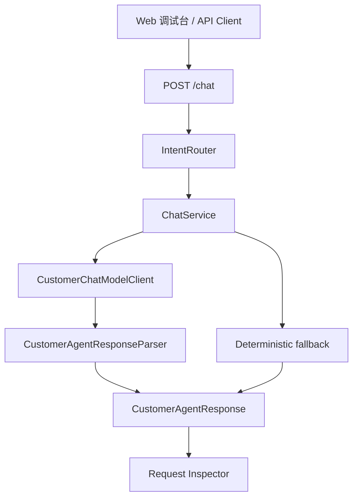

# Day 10：阶段 2 集成验证

## 结论

Day 10 已把阶段 2 的 `/chat -> intent -> LLM/fallback -> response` 链路收口到可验证状态，并在 Web 调试台补齐 `Request Inspector`，用于查看结构化 Agent 响应中的：

```text
route / riskLevel / traceId / answer / sources / nextActions
```

今天不进入 Day 11 的 Tool Calling，不新增工具契约、MCP、RAG、真实退款、真实取消或真实人工工单。当前只做阶段 2 的集成验证和调试台展示闭环。

## 今日目标

1. 通过 `/chat` 集成测试覆盖阶段 2 的 4 类核心客服场景。
2. 保持 Java 层继续作为 `route`、`riskLevel` 和服务端 `traceId` 的最终真相。
3. 在 Web 调试台中把结构化响应拆成客服回复和 `Request Inspector`。
4. 验证前端能展示 `route`、`riskLevel`、`traceId`、`sources` 和 `nextActions`。
5. 输出阶段 2 复盘文档，明确下一阶段 Tool Calling 的入口边界。

## 业务场景

### 课程咨询

用户问：

```text
新手适合学企业级 AI Agent 课程吗？
```

系统返回：

```text
route=KNOWLEDGE_QA
riskLevel=READ_ONLY
```

当前不编造知识库答案，只提示等待 RAG 知识库接入。

### 订单查询

用户问：

```text
帮我查询订单 order-1001 什么时候开课
```

系统返回：

```text
route=ORDER_LOOKUP
riskLevel=READ_ONLY
sources=["order:order-1001"]
```

模型启用时，只允许模型基于订单证据生成客服文案；模型不能改写 Java 层路由和风险级别。

### 人工转接

用户问：

```text
我要转人工客服
```

系统返回：

```text
route=HUMAN_HANDOFF
riskLevel=LOW_RISK_WRITE
```

当前只记录人工转接意向，不创建外部工单。

### 退款请求

用户问：

```text
订单 order-1001 可以退款吗？
```

系统返回：

```text
route=REFUND_OR_CANCEL
riskLevel=HIGH_RISK
```

系统只提示进入人工审批前置判断，不执行真实退款、取消或改签。

## 模块边界

### `customer-agent-app` 负责

- 对 `/chat` 执行完整 HTTP 集成验证。
- 覆盖课程咨询、订单查询、人工转接、退款请求 4 类阶段 2 场景。
- 输出稳定 `CustomerAgentResponse`。
- 保持服务端 `X-Trace-Id` 与响应体 `traceId` 一致。

### `customer-admin-web` 负责

- 提供 Chat Console 输入区。
- 展示 `Request Inspector`，便于调试 route、risk level 和 trace。
- 展示客服回复、sources 和 next actions。

### 当前不负责

- 不定义 Day 11 的 `ToolDefinition`、`ToolResult` 或 `ToolPermission`。
- 不做真实工具调用链。
- 不接入 RAG、MCP、Memory 或审批流。
- 不连接远程服务器，不执行 DDL，不修改中间件配置。

## 分层设计



设计点：

- `/chat` 的 HTTP 集成测试验证的是外部契约，不依赖内部实现细节。
- `Request Inspector` 只消费 API 响应字段，不复制后端路由逻辑。
- 前端展示层保持轻量，不在 Day 10 扩成完整运营后台或监控台。

## 接口设计

`POST /chat` 请求结构：

```json
{
  "tenantId": "tenant-demo",
  "message": "帮我查询订单 order-1001 什么时候开课"
}
```

响应结构：

```json
{
  "route": "ORDER_LOOKUP",
  "answer": "已查询到订单 order-1001，课程为「企业级 AI Agent 实战营」，当前状态为 PAID。",
  "sources": ["order:order-1001"],
  "riskLevel": "READ_ONLY",
  "nextActions": ["展示订单状态", "等待用户继续追问"],
  "traceId": "trace-stage2-order"
}
```

## Web 调试台

Day 10 后，`customer-admin-web` 的 Chat Console 分为两块：

| 区域 | 职责 |
| --- | --- |
| 输入区 | 输入租户和用户消息，调用 `/chat` |
| `Request Inspector` | 展示 `Route`、`Risk Level`、`Trace ID` |
| `Answer` | 展示客服回复正文 |
| `Sources` | 展示订单或知识来源引用 |
| `Next Actions` | 展示下一步建议 |

## 测试用例

| 测试 | 覆盖点 |
| --- | --- |
| `CustomerAgentApiTest.shouldRouteStage2ChatScenariosThroughChatApi` | 课程咨询、订单查询、人工转接、退款请求的 `/chat` 集成验证 |
| `CustomerAgentApiTest.shouldReturnStructuredChatResponse` | `/chat` 返回 Day 09 统一字段 |
| `App renders the interactive debug console shell` | SSR 渲染包含 `Request Inspector` 和结构化字段 |
| `App sends custom chat messages from the debug console` | 前端发送 `/chat` 后展示最新结构化响应 |

## 验证方式

红灯阶段：

```bash
cd projects/enterprise-customer-service-agent/customer-admin-web
npm test -- --run src/App.test.tsx
```

已观察到缺少 `Request Inspector` 导致前端测试失败。

绿灯阶段：

```bash
cd projects/enterprise-customer-service-agent
mvn -pl customer-agent-app -am test -Dtest=CustomerAgentApiTest -Dsurefire.failIfNoSpecifiedTests=false
```

通过标准：

- `Tests run: 14`
- `Failures: 0`
- `Errors: 0`
- `Skipped: 0`

前端定向验证：

```bash
cd projects/enterprise-customer-service-agent/customer-admin-web
npm test -- --run src/App.test.tsx
```

通过标准：

- `Test Files 1 passed`
- `Tests 2 passed`

阶段 2 回归建议：

```bash
cd projects/enterprise-customer-service-agent
mvn test

cd customer-admin-web
npm test
npm run build
```

## 原则应用

- KISS：只补阶段 2 集成测试和轻量 Inspector，不引入新的前端状态架构。
- YAGNI：不提前实现 Tool Calls 面板、RAG Sources 面板或审批模拟。
- DRY：前端复用 `CustomerAgentResponse` 字段展示，不复制后端路由和风险判断。
- SOLID：后端 API 测试验证契约，前端 Inspector 只负责展示，业务决策仍在 Java 服务层。
