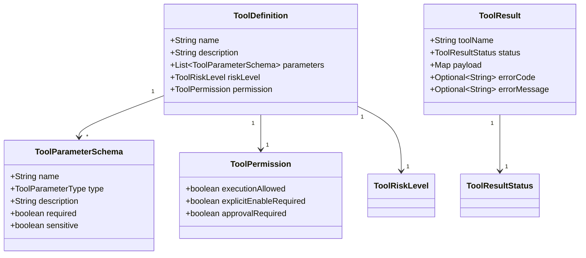

# Day 11：定义工具契约

## 结论

Day 11 已建立企业客服 Agent 的统一工具契约，落点在 `customer-domain`。

今天只定义工具的稳定边界：

- 工具定义：`ToolDefinition`
- 工具参数 schema：`ToolParameterSchema`
- 参数类型：`ToolParameterType`
- 工具权限：`ToolPermission`
- 工具执行结果：`ToolResult`

今天不实现 `order_lookup` 具体工具，不接入 Spring AI Tool Calling，不做 MCP Server，也不改 `/chat` 的现有阶段 2 行为。

## 今日目标

1. 让所有后续工具都能声明名称、描述、参数 schema、风险等级和权限策略。
2. 明确只读、低风险写入和高风险工具的默认执行边界。
3. 统一成功和失败工具结果，避免每个工具各自定义错误语义。
4. 为 Day 12 的订单查询工具提供领域契约基础。

## 业务场景

### 订单查询工具

后续 Day 12 的 `order_lookup(orderId, tenantId)` 需要声明：

| 字段 | 示例 |
| --- | --- |
| name | `order_lookup` |
| description | 按订单号和租户查询订单状态 |
| required parameters | `orderId`, `tenantId` |
| riskLevel | `READ_ONLY` |
| permission | 默认允许执行 |

### 人工转接工具

后续 Day 13 的 `handoff_to_human` 属于低风险写入：

- 不直接对接外部真实派单系统。
- 需要显式启用后才能执行。
- 执行结果必须进入 trace。

### 退款政策检查工具

后续 Day 14 的 `refund_policy_check` 只做政策判断：

- 可以是只读工具。
- 不能执行真实退款、取消或改签。
- 真正资金和订单写操作仍属于高风险审批边界。

## 模块边界

### `customer-domain` 负责

- 表达工具契约和权限语义。
- 提供不可变工具定义和工具结果对象。
- 校验工具名、参数名、描述、重复参数和失败错误码。
- 保持纯 Java，不依赖 Spring Web、Spring AI、MCP、JPA 或 JDBC。

### `customer-agent-app` 暂不负责

- 不根据意图执行真实工具。
- 不接入 Spring AI Tool Calling。
- 不展示 Tool Calls 面板。

### `customer-mcp-server` 暂不负责

- 不暴露 MCP tools。
- 不处理 MCP tool input schema 映射。
- 不实现 MCP Client / Server 调用闭环。

## 接口设计

### 工具定义

```java
var definition = ToolDefinition.readOnly(
        "order_lookup",
        "按订单号和租户查询订单状态",
        List.of(
                ToolParameterSchema.required("orderId", ToolParameterType.STRING, "订单号"),
                ToolParameterSchema.required("tenantId", ToolParameterType.STRING, "租户 ID")));
```

契约字段：

| 字段 | 说明 |
| --- | --- |
| `name` | 工具唯一名称，不能为空 |
| `description` | 给 Agent 和调试台看的工具说明，不能为空 |
| `parameters` | 参数 schema，不允许重复参数名 |
| `riskLevel` | `READ_ONLY`、`LOW_RISK_WRITE`、`HIGH_RISK` |
| `permission` | 从风险级别推导默认执行策略 |

### 权限策略

| 风险级别 | 默认权限 | 原因 |
| --- | --- | --- |
| `READ_ONLY` | 默认允许执行 | 订单查询、知识库检索不改变外部状态 |
| `LOW_RISK_WRITE` | 默认关闭，需要显式启用 | 人工转接记录属于写入动作 |
| `HIGH_RISK` | 默认关闭，需要显式启用并人工审批 | 真实退款、取消订单、改签等不能自动执行 |

### 工具结果

成功：

```java
ToolResult.succeeded(
        "order_lookup",
        Map.of("orderStatus", "PAID"));
```

失败：

```java
ToolResult.failed(
        "order_lookup",
        "ORDER_NOT_FOUND",
        "订单不存在或不属于当前租户");
```

失败结果必须带明确 `errorCode` 和 `errorMessage`，便于后续 trace、调试台和客服回复定位问题。

## 数据模型



## 安全边界

- 工具参数 schema 支持 `sensitive` 标记，后续用于 trace 和调试台脱敏。
- 低风险写入和高风险工具默认不允许直接执行。
- 高风险工具必须进入人工审批边界。
- 工具结果不保存 API key、token、密码或模型密钥。

## 验证方式

红灯阶段：

```bash
cd projects/enterprise-customer-service-agent
mvn -pl customer-domain -Dtest=ToolDefinitionTest,ToolResultTest -Dsurefire.failIfNoSpecifiedTests=false test
```

已观察到 `ToolDefinition`、`ToolPermission`、`ToolParameterSchema`、`ToolResult` 等契约缺失导致编译失败。

绿灯阶段：

```bash
cd projects/enterprise-customer-service-agent
mvn -pl customer-domain -Dtest=ToolDefinitionTest,ToolResultTest -Dsurefire.failIfNoSpecifiedTests=false test
```

通过标准：

- `Tests run: 6`
- `Failures: 0`
- `Errors: 0`
- `Skipped: 0`

完整后端回归：

```bash
cd projects/enterprise-customer-service-agent
mvn test
```

## 测试用例

| 测试 | 覆盖点 |
| --- | --- |
| `ToolDefinitionTest.shouldDescribeToolContractWithParametersRiskAndPermission` | 工具名、描述、参数、风险和权限契约 |
| `ToolDefinitionTest.shouldRejectDuplicateParameterNames` | 拒绝重复参数名 |
| `ToolDefinitionTest.shouldDerivePermissionFromRiskLevel` | 风险级别到默认权限策略的映射 |
| `ToolResultTest.shouldRepresentSuccessfulToolResult` | 成功工具结果 payload |
| `ToolResultTest.shouldRepresentFailedToolResultWithExplicitCode` | 失败工具结果错误码和错误信息 |
| `ToolResultTest.shouldRejectFailedResultWithoutErrorCode` | 失败结果必须可定位 |

## 原则应用

- KISS：只定义今天需要的工具契约，不引入 JSON schema 库或 Spring AI 适配层。
- YAGNI：不提前实现订单工具、知识库工具、MCP Server 或 Tool Calls 面板。
- DRY：所有工具共享同一套定义、权限和结果模型，避免后续每个工具重复造结构。
- SOLID：领域契约与具体执行、框架适配分离；后续工具实现依赖契约，不依赖具体 Agent 编排。
