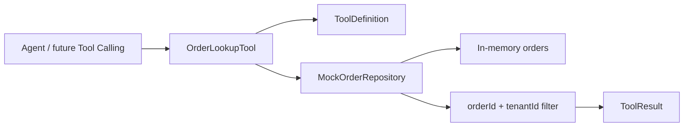

# Day 12：实现订单查询工具

## 结论

Day 12 已在 `customer-agent-app` 实现第一个真实业务工具：

```text
order_lookup(orderId, tenantId)
```

它是只读工具，用于按订单号和租户查询订单摘要，并复用 Day 11 的统一工具契约：

- `ToolDefinition`
- `ToolParameterSchema`
- `ToolResult`
- `ToolRiskLevel.READ_ONLY`
- `ToolPermission.allowReadOnly()`

今天仍不接入 Spring AI Tool Calling，不改 `/chat` 的阶段 2 行为，不做 MCP Server，不展示 Tool Calls 面板。

## 今日目标

1. 实现 `OrderLookupTool`，让 Agent 后续可以通过稳定接口查询订单。
2. 为 `order_lookup` 声明名称、描述、必填参数、风险级别和默认权限。
3. 使用 mock repository 查询订单，保持本地可测试闭环。
4. 明确订单不存在和跨租户访问的失败语义。
5. 用测试验证成功、订单不存在、跨租户查询、参数缺失和工具定义。

## 业务场景

### 同租户订单查询

输入：

```text
orderId=order-1001
tenantId=tenant-demo
```

输出：

```text
status=SUCCEEDED
payload.orderId=order-1001
payload.tenantId=tenant-demo
payload.status=PAID
```

### 订单不存在

输入：

```text
orderId=missing-order
tenantId=tenant-demo
```

输出：

```text
status=FAILED
errorCode=ORDER_NOT_FOUND
errorMessage=订单不存在或不属于当前租户
```

### 跨租户查询

输入：

```text
orderId=order-1001
tenantId=tenant-other
```

输出仍为：

```text
status=FAILED
errorCode=ORDER_NOT_FOUND
```

这里故意不暴露“订单存在但租户不匹配”的细节，避免跨租户探测订单号。

### 参数缺失

输入：

```text
orderId=<blank>
tenantId=tenant-demo
```

输出：

```text
status=FAILED
errorCode=INVALID_ARGUMENT
errorMessage=缺少必填参数: orderId
```

Agent 工具不把参数错误作为 Java 异常外抛，而是返回结构化失败，便于后续 trace 和调试台展示。

## 模块边界

### `customer-agent-app` 负责

- `OrderLookupTool`：声明工具定义并执行订单查询。
- `MockOrderRepository`：提供 `findByIdAndTenantId`，在数据入口处约束租户。
- `OrderLookupToolTest`：验证工具定义、成功 payload 和失败语义。

### `customer-domain` 负责

- 继续只表达通用工具契约。
- 不依赖 Spring、repository、订单查询实现或 Agent 编排。

### 当前不负责

- 不把 `OrderLookupTool` 接入 `/chat`。
- 不接 Spring AI Tool Calling。
- 不接 MCP Server。
- 不查询 PostgreSQL。
- 不执行真实退款、取消、改签或任何写操作。

## 接口设计

工具定义：

```java
ToolDefinition.readOnly(
        "order_lookup",
        "按订单号和租户查询订单状态",
        List.of(
                ToolParameterSchema.required("orderId", ToolParameterType.STRING, "订单号"),
                ToolParameterSchema.required("tenantId", ToolParameterType.STRING, "租户 ID")));
```

工具执行：

```java
ToolResult lookup(String orderId, String tenantId)
```

成功 payload：

| 字段 | 说明 |
| --- | --- |
| `orderId` | 订单号 |
| `tenantId` | 租户标识 |
| `customerId` | 客户标识 |
| `productName` | 产品名称 |
| `status` | 订单状态 |
| `paidAt` | 支付时间 |

失败结果：

| 字段 | 值 |
| --- | --- |
| `status` | `FAILED` |
| `errorCode` | `ORDER_NOT_FOUND` 或 `INVALID_ARGUMENT` |
| `payload` | 空 map |

## 数据流



设计点：

- 租户过滤放在 repository 查询方法中，不先把跨租户订单暴露到工具层再判断。
- 工具失败统一使用 `ToolResult.failed`，便于后续 trace 和调试台展示。
- 必填参数缺失返回 `INVALID_ARGUMENT`，不让工具调用异常外溢。
- 工具结果只包含客服回复所需的订单摘要，不加入未使用字段。

## 安全边界

- `order_lookup` 是 `READ_ONLY`，默认允许执行。
- `tenantId` 是必填参数，不能省略。
- 跨租户查询与订单不存在使用同一个 `ORDER_NOT_FOUND` 错误码，避免订单枚举。
- 空 `orderId` 或 `tenantId` 返回 `INVALID_ARGUMENT`。
- 工具结果不包含密钥、token、支付凭据或内部配置。
- 当前 mock 数据只服务本地学习，不代表生产数据访问策略。

## 验证方式

红灯阶段：

```bash
cd projects/enterprise-customer-service-agent
mvn -pl customer-agent-app -am -Dtest=OrderLookupToolTest -Dsurefire.failIfNoSpecifiedTests=false test
```

已观察到测试因为 `OrderLookupTool` 缺失而编译失败。

绿灯阶段：

```bash
cd projects/enterprise-customer-service-agent
mvn -pl customer-agent-app -am -Dtest=OrderLookupToolTest -Dsurefire.failIfNoSpecifiedTests=false test
```

通过标准：

- `Tests run: 5`
- `Failures: 0`
- `Errors: 0`
- `Skipped: 0`

完整后端回归建议：

```bash
cd projects/enterprise-customer-service-agent
mvn test
```

## 测试用例

| 测试 | 覆盖点 |
| --- | --- |
| `OrderLookupToolTest.shouldExposeReadOnlyOrderLookupDefinition` | 工具名、风险级别、默认权限和必填参数 |
| `OrderLookupToolTest.shouldReturnOrderPayloadForSameTenant` | 同租户订单查询成功 payload |
| `OrderLookupToolTest.shouldReturnExplicitFailureWhenOrderDoesNotExist` | 订单不存在的明确失败语义 |
| `OrderLookupToolTest.shouldNotExposeOrderAcrossTenants` | 跨租户查询不泄露订单 |
| `OrderLookupToolTest.shouldReturnInvalidArgumentWhenRequiredInputIsBlank` | 必填参数缺失返回结构化失败 |

## 学习重点

### Tool Calling 不是直接写一个 Service

普通 service 只服务 Java 调用方；Agent 工具还需要可发现、可解释、可治理：

- 名称要稳定。
- 参数 schema 要明确。
- 风险级别要可审计。
- 失败语义要能被 Agent、trace 和调试台消费。

### 租户隔离要尽早发生

跨租户查询不能先返回订单再由上层隐藏字段。更稳的做法是在查询入口就包含 `tenantId` 条件，让“不存在”和“不属于当前租户”走同一失败出口。

### Day 12 暂不接 `/chat`

今天的目标是先有一个可测试工具。让 Agent 自动选择并调用工具属于 Day 15；如果今天提前接入，会把工具实现、模型调用、trace、调试台展示混在一起，边界会变差。

## 原则应用

- KISS：只实现一个 `order_lookup` 工具和一个租户过滤查询方法。
- YAGNI：不引入数据库、Spring AI Tool Calling、MCP 或 Tool Calls 面板。
- DRY：成功和失败结果复用 Day 11 的 `ToolResult`，不为订单工具单独造响应结构。
- SOLID：工具定义、工具执行、订单数据读取和通用领域契约分层清楚；后续替换 PostgreSQL repository 时不需要改工具契约。
