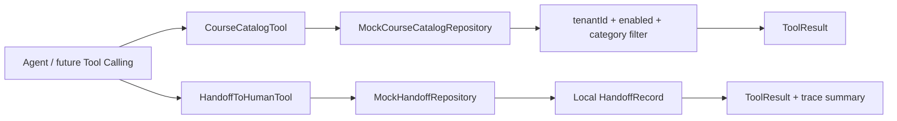

# Day 13：实现知识目录与人工转接工具

## 结论

Day 13 在 `customer-agent-app` 补齐两个客服基本动作工具：

```text
course_catalog(tenantId, category?)
handoff_to_human(tenantId, conversationId, reason, orderId?)
```

今天仍不接入 Spring AI Tool Calling，不改 `/chat` 的阶段 2 行为，不创建真实客服工单，不调用外部派单系统。

## 今日目标

1. 实现只读知识目录工具，让 Agent 能查询租户可用课程和政策目录。
2. 实现低风险人工转接工具，只创建本地转接记录。
3. 为两个工具声明稳定工具定义、参数 schema、风险级别和权限策略。
4. 在 `handoff_to_human` 返回 payload 中带最小 trace 摘要，服务后续 Tool Calls 面板。
5. 用测试验证工具定义、成功 payload、参数错误、租户隔离和“不真实派单”边界。

## 业务场景

### 查询课程目录

输入：

```text
tenantId=tenant-demo
category=<empty>
```

输出：

```text
status=SUCCEEDED
payload.tenantId=tenant-demo
payload.category=ALL
payload.items=[启用课程和政策目录]
```

停用课程不会返回，其他租户课程也不会返回。

### 按分类查询产品目录

输入：

```text
tenantId=tenant-demo
category=PRODUCT
```

输出只包含产品或课程类条目，不包含政策类条目。

### 创建人工转接记录

输入：

```text
tenantId=tenant-demo
conversationId=conversation-1001
reason=用户要求人工协助确认课程安排
orderId=order-1001
```

输出：

```text
status=SUCCEEDED
payload.status=CREATED
payload.externalDispatch=false
payload.nextAction=WAIT_FOR_HUMAN_AGENT
```

`externalDispatch=false` 是 Day 13 的关键边界：工具只创建本地记录，不代表已经通知真实客服系统。

## 模块边界

### `customer-agent-app` 负责

- `CourseCatalogTool`：声明并执行 `course_catalog`。
- `MockCourseCatalogRepository`：提供启用目录查询和租户过滤。
- `HandoffToHumanTool`：声明并执行 `handoff_to_human`。
- `MockHandoffRepository`：保存本地人工转接记录。
- `CourseCatalogToolTest` / `HandoffToHumanToolTest`：验证工具定义、成功和失败语义。

### `customer-domain` 负责

- 继续提供 `ToolDefinition`、`ToolResult`、`ToolRiskLevel`、`ToolPermission` 等通用契约。
- 不依赖具体工具实现、Spring Bean 或本地 mock 数据。

### 当前不负责

- 不把两个工具接入 `/chat` 自动调用。
- 不接 MCP Server。
- 不接 PostgreSQL 或知识库管理 API。
- 不调用外部工单、客服、短信、企微或生产 API。
- 不实现退款政策检查，Day 14 再处理。

## 接口设计

### `course_catalog`

工具定义：

```java
ToolDefinition.readOnly(
        "course_catalog",
        "按租户查询可用课程和政策目录",
        List.of(
                ToolParameterSchema.required("tenantId", ToolParameterType.STRING, "租户 ID"),
                ToolParameterSchema.optional("category", ToolParameterType.STRING, "知识分类，可选 PRODUCT、POLICY、FAQ")));
```

工具执行：

```java
ToolResult list(String tenantId, String category)
```

成功 payload：

| 字段 | 说明 |
| --- | --- |
| `tenantId` | 租户标识 |
| `category` | `ALL` 或指定知识分类 |
| `items` | 启用目录条目列表 |

失败结果：

| errorCode | 场景 |
| --- | --- |
| `INVALID_ARGUMENT` | `tenantId` 为空或 `category` 非法 |
| `CATALOG_NOT_FOUND` | 当前租户和分类下没有启用目录 |

### `handoff_to_human`

工具定义：

```java
new ToolDefinition(
        "handoff_to_human",
        "创建本地人工转接记录，不触发外部真实派单",
        parameters,
        ToolRiskLevel.LOW_RISK_WRITE,
        ToolPermission.defaultFor(ToolRiskLevel.LOW_RISK_WRITE));
```

工具执行：

```java
ToolResult create(String tenantId, String conversationId, String reason, String orderId)
```

成功 payload：

| 字段 | 说明 |
| --- | --- |
| `handoffId` | 本地转接记录 ID |
| `tenantId` | 租户标识 |
| `conversationId` | 会话标识 |
| `orderId` | 可选订单号 |
| `status` | `CREATED` |
| `externalDispatch` | 固定为 `false` |
| `nextAction` | `WAIT_FOR_HUMAN_AGENT` |
| `trace` | 工具名、风险级别、状态和耗时摘要 |

## 数据流



设计点：

- 课程目录和转人工都是普通 Agent 工具，不直接依赖模型。
- 目录工具只读，默认允许执行。
- 转人工属于低风险写入，默认关闭，需要显式启用。
- trace 暂时放在工具 payload 中，Day 15 再统一接入 Tool Calls 面板。

## 安全边界

- `course_catalog` 是 `READ_ONLY`，默认允许执行。
- `handoff_to_human` 是 `LOW_RISK_WRITE`，默认不允许执行，必须显式启用。
- 人工转接只写本地内存记录，不调用外部系统。
- `reason` 为空时拒绝创建记录。
- `externalDispatch=false` 明确阻止调用方误解为真实派单。
- 工具 payload 不包含密钥、token、支付凭据或数据库连接信息。

## 验证方式

红灯阶段：

```bash
cd projects/enterprise-customer-service-agent
mvn -pl customer-agent-app -am -Dtest=CourseCatalogToolTest,HandoffToHumanToolTest -Dsurefire.failIfNoSpecifiedTests=false test
```

已观察到测试因 `CourseCatalogTool`、`HandoffToHumanTool` 和 `MockHandoffRepository` 缺失而编译失败。

绿灯阶段：

```bash
cd projects/enterprise-customer-service-agent
mvn -pl customer-agent-app -am -Dtest=CourseCatalogToolTest,HandoffToHumanToolTest -Dsurefire.failIfNoSpecifiedTests=false test
```

通过标准：

- `Tests run: 10`
- `Failures: 0`
- `Errors: 0`
- `Skipped: 0`

完整后端回归建议：

```bash
cd projects/enterprise-customer-service-agent
mvn test
```

## 测试用例

| 测试 | 覆盖点 |
| --- | --- |
| `CourseCatalogToolTest.shouldExposeReadOnlyCourseCatalogDefinition` | 目录工具定义、只读风险和必填参数 |
| `CourseCatalogToolTest.shouldReturnEnabledCatalogItemsForTenant` | 同租户启用目录查询 |
| `CourseCatalogToolTest.shouldFilterCatalogItemsByCategory` | 分类过滤 |
| `CourseCatalogToolTest.shouldReturnInvalidArgumentWhenTenantIdIsBlank` | 租户参数缺失 |
| `CourseCatalogToolTest.shouldReturnNoCatalogItemsWhenTenantHasNoEnabledCatalog` | 无目录命中失败语义 |
| `HandoffToHumanToolTest.shouldExposeLowRiskWriteHandoffDefinition` | 转人工工具定义和低风险写权限 |
| `HandoffToHumanToolTest.shouldCreateLocalHandoffRecordWithoutExternalDispatch` | 只创建本地记录，不真实派单 |
| `HandoffToHumanToolTest.shouldCreateTraceSummaryForDebugPanel` | trace 摘要 |
| `HandoffToHumanToolTest.shouldReturnInvalidArgumentWhenReasonIsBlank` | 原因缺失时不创建记录 |
| `HandoffToHumanToolTest.shouldKeepAllLocalHandoffRecordsWhenCreatedConcurrently` | 并发创建本地记录时不丢失 |

## 学习重点

### 低风险写入也不能默认执行

人工转接看起来比退款安全，但它仍然改变系统状态。工具契约里必须把它标成 `LOW_RISK_WRITE`，并通过 `ToolPermission.disabledLowRiskWrite()` 表达“显式启用后才能执行”。

### 先用本地记录表达业务事实

Day 13 的目标不是建设工单系统，而是让 Agent 有稳定工具边界。先创建本地记录，可以把工具参数、失败语义、权限和 trace 打稳，再在后续阶段替换成数据库或外部派单。

### trace 先服务调试，不急着平台化

今天只在 payload 里返回 `toolName / riskLevel / status / latencyMs`。统一 trace 存储、Tool Calls 面板和审计日志属于后续集成工作。

## 原则应用

- KISS：只做两个工具和内存仓储，不引入数据库、队列或外部工单系统。
- YAGNI：不提前实现知识库 CRUD、RAG 检索、MCP 映射或真实派单。
- DRY：两个工具复用 `ToolDefinition`、`ToolResult`、`ToolPermission`，不重复造响应模型。
- SOLID：工具执行、mock 数据源、本地转接记录和通用工具契约职责分离；后续替换持久化实现不影响工具调用契约。
