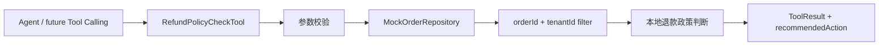

# Day 14：实现退款政策检查工具

## 结论

Day 14 在 `customer-agent-app` 新增只读工具：

```text
refund_policy_check(orderId, tenantId)
```

该工具只返回退款或取消的前置政策判断和建议动作，不执行真实退款、不取消订单、不写数据库、不调用支付或生产 API。

## 今日目标

1. 为退款/取消诉求提供确定性前置检查工具。
2. 复用订单查询的租户隔离边界，避免跨租户读取订单。
3. 将工具声明为 `READ_ONLY`，默认允许执行。
4. 返回可审查的政策结果：`ELIGIBLE_FOR_REVIEW`、`REQUIRES_MANUAL_APPROVAL`、`NOT_ELIGIBLE`。
5. 用测试证明工具不会产生真实资金操作语义。

## 业务场景

### 支付订单处于政策窗口内

输入：

```text
orderId=order-1001
tenantId=tenant-demo
```

输出：

```text
status=SUCCEEDED
payload.policyDecision=ELIGIBLE_FOR_REVIEW
payload.recommendedAction=CREATE_APPROVAL_REQUEST
payload.fundOperationExecuted=false
```

含义：订单可以进入人工审批流程，但退款尚未执行。

### 支付订单超过政策窗口

输入：

```text
orderId=order-legacy-paid
tenantId=tenant-demo
```

输出：

```text
payload.policyDecision=REQUIRES_MANUAL_APPROVAL
payload.recommendedAction=ESCALATE_TO_HUMAN_REVIEW
payload.fundOperationExecuted=false
```

含义：订单超过 30 天，需要人工复核政策。

### 已退款订单

输入：

```text
orderId=order-refunded
tenantId=tenant-demo
```

输出：

```text
payload.policyDecision=NOT_ELIGIBLE
payload.recommendedAction=EXPLAIN_POLICY
payload.fundOperationExecuted=false
```

含义：订单已退款，不能重复发起退款。

## 模块边界

### `customer-agent-app` 负责

- `RefundPolicyCheckTool`：声明并执行 `refund_policy_check`。
- `MockOrderRepository`：提供支付、超期、已退款、已取消订单样本。
- `RefundPolicyCheckToolTest`：验证工具定义、政策分支、跨租户和参数错误。

### `customer-domain` 负责

- 继续提供 `ToolDefinition`、`ToolResult`、`ToolRiskLevel`、`ToolPermission` 等通用契约。
- 不关心具体退款政策规则。

### 当前不负责

- 不接入 Spring AI Tool Calling。
- 不改 `/chat` 行为。
- 不创建真实审批单。
- 不写订单状态。
- 不调用支付、退款、取消、企微或生产 API。
- 不接 MCP Server。

## 接口设计

工具定义：

```java
ToolDefinition.readOnly(
        "refund_policy_check",
        "按订单号和租户检查退款或取消前置政策，不执行真实退款",
        List.of(
                ToolParameterSchema.required("orderId", ToolParameterType.STRING, "订单号"),
                ToolParameterSchema.required("tenantId", ToolParameterType.STRING, "租户 ID")));
```

工具执行：

```java
ToolResult check(String orderId, String tenantId)
```

成功 payload：

| 字段 | 说明 |
| --- | --- |
| `orderId` | 订单号 |
| `tenantId` | 租户标识 |
| `orderStatus` | 当前订单状态 |
| `policyDecision` | 政策判断 |
| `recommendedAction` | 建议动作 |
| `reason` | 判断原因 |
| `fundOperationExecuted` | 固定为 `false` |

失败结果：

| errorCode | 场景 |
| --- | --- |
| `INVALID_ARGUMENT` | `orderId` 或 `tenantId` 为空 |
| `ORDER_NOT_FOUND` | 订单不存在或不属于当前租户 |

## 规则设计

| 条件 | `policyDecision` | `recommendedAction` |
| --- | --- | --- |
| `REFUNDED` | `NOT_ELIGIBLE` | `EXPLAIN_POLICY` |
| `CANCELLED` | `NOT_ELIGIBLE` | `EXPLAIN_POLICY` |
| 非 `PAID` | `NOT_ELIGIBLE` | `EXPLAIN_POLICY` |
| `PAID` 且超过 30 天 | `REQUIRES_MANUAL_APPROVAL` | `ESCALATE_TO_HUMAN_REVIEW` |
| `PAID` 且 30 天内 | `ELIGIBLE_FOR_REVIEW` | `CREATE_APPROVAL_REQUEST` |

## 数据流



## 安全边界

- `refund_policy_check` 是 `READ_ONLY` 工具，默认允许执行。
- 工具只读取 mock 订单数据，不写状态。
- 跨租户访问统一返回 `ORDER_NOT_FOUND`，不泄漏真实订单归属。
- `fundOperationExecuted=false` 固定写入 payload，防止调用方误解为退款已执行。
- 高风险真实退款、取消订单和支付接口调用必须留到审批流程后续阶段。

## 验证方式

红灯阶段：

```bash
cd projects/enterprise-customer-service-agent
mvn -pl customer-agent-app -am -Dtest=RefundPolicyCheckToolTest -Dsurefire.failIfNoSpecifiedTests=false test
```

已观察到测试因 `RefundPolicyCheckTool` 缺失而编译失败。

绿灯阶段：

```bash
cd projects/enterprise-customer-service-agent
mvn -pl customer-agent-app -am -Dtest=RefundPolicyCheckToolTest -Dsurefire.failIfNoSpecifiedTests=false test
```

通过标准：

- `Tests run: 6`
- `Failures: 0`
- `Errors: 0`
- `Skipped: 0`

完整后端回归建议：

```bash
cd projects/enterprise-customer-service-agent
mvn test
```

## 测试用例

| 测试 | 覆盖点 |
| --- | --- |
| `shouldExposeReadOnlyRefundPolicyCheckDefinition` | 工具定义、只读风险、必填参数 |
| `shouldReturnEligibleReviewWhenPaidOrderIsInsidePolicyWindow` | 30 天内已支付订单可进入人工审批 |
| `shouldRequireManualApprovalWhenPaidOrderIsOutsidePolicyWindow` | 超出政策窗口需人工复核 |
| `shouldRejectAlreadyRefundedOrderWithoutFundOperation` | 已退款订单不可重复退款 |
| `shouldNotExposeRefundPolicyAcrossTenants` | 跨租户订单不可见 |
| `shouldReturnInvalidArgumentWhenOrderIdIsBlank` | 必填参数缺失 |

## 学习重点

### 政策检查不是资金操作

`refund_policy_check` 的职责是回答“能否进入下一步审批”，不是执行退款。工具 payload 中固定返回 `fundOperationExecuted=false`，让 API、调试台和未来 Agent Loop 都能清楚识别边界。

### 读工具也要做租户隔离

退款政策依赖订单状态。只要工具会读取订单，就必须和 `order_lookup` 一样用 `orderId + tenantId` 过滤，避免通过政策判断暴露其他租户订单是否存在。

### 建议动作要可编排

`recommendedAction` 先用稳定枚举文本表达后续动作：解释政策、创建审批、升级人工复核。Day 15 接入 Tool Calling 时，Agent 可以直接把它写入结构化回复或 Tool Calls 面板。

## 原则应用

- KISS：用一个工具类和本地规则完成当天目标。
- YAGNI：不创建审批单、不接支付、不接数据库。
- DRY：复用现有 `ToolDefinition`、`ToolResult` 和 mock 订单仓库。
- SOLID：工具只负责政策检查，订单存取仍由仓库负责，未来可替换规则来源而不改调用契约。
