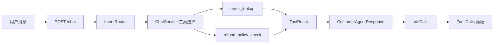

# Day 15：Tool Calling 集成

## 结论

Day 15 将阶段 3 已实现的订单和退款政策工具接入 `/chat`：

```text
chat -> intent route -> Java-side tool selection -> tool execution -> CustomerAgentResponse.toolCalls -> Web Tool Calls panel
```

当前采用 Java 层确定性工具编排，而不是让模型自由选择工具。这样能先把参数校验、租户边界、风险等级、耗时和结果摘要打稳，避免在阶段 3 过早引入复杂 Agent Loop。

## 今日目标

1. 用户查询订单时，`/chat` 调用 `order_lookup`。
2. 用户要求退款或取消时，`/chat` 调用 `refund_policy_check`。
3. `CustomerAgentResponse` 返回 `toolCalls` 明细。
4. Web 调试台展示工具名、参数、耗时、状态、风险级别和结果摘要。
5. 退款诉求只返回政策判断和审批建议，不执行真实退款、取消或改签。

## 业务场景

### 订单查询

输入：

```json
{
  "tenantId": "tenant-demo",
  "message": "帮我查询订单 order-1001 什么时候开课"
}
```

输出要点：

```text
route=ORDER_LOOKUP
riskLevel=READ_ONLY
toolCalls[0].name=order_lookup
toolCalls[0].arguments.orderId=order-1001
toolCalls[0].status=SUCCEEDED
sources[0]=order:order-1001
```

### 退款政策检查

输入：

```json
{
  "tenantId": "tenant-demo",
  "message": "订单 order-1001 可以退款吗？"
}
```

输出要点：

```text
route=REFUND_OR_CANCEL
riskLevel=HIGH_RISK
toolCalls[0].name=refund_policy_check
toolCalls[0].riskLevel=READ_ONLY
answer 包含 ELIGIBLE_FOR_REVIEW
nextActions[0]=创建人工审批请求
```

注意：对话整体风险是 `HIGH_RISK`，因为用户诉求涉及退款；实际执行的工具仍是 `READ_ONLY`，只做政策判断。

## 模块边界

### `customer-agent-app` 负责

- `ChatService`：根据 `IntentRouter` 结果选择只读工具。
- `CustomerAgentResponse`：新增 `toolCalls` 字段。
- `CustomerAgentToolCall`：承载工具调用摘要。
- `OrderLookupTool`：为订单路线提供订单证据。
- `RefundPolicyCheckTool`：为退款路线提供政策判断。
- `CustomerAgentApiTest` / `ChatServiceModelClientTest`：验证接口和服务层工具调用链路。

### `customer-admin-web` 负责

- 扩展 `CustomerAgentResponse` 类型。
- 在 Chat Console 结果区新增 Tool Calls 面板。
- 展示工具名、参数、状态、风险、耗时和结果摘要。

### 当前不负责

- 不接 MCP Server / Client。
- 不实现模型自由 Tool Calling。
- 不接 RAG。
- 不创建真实审批单。
- 不执行退款、取消、改签。
- 不调用支付、工单、企微或生产 API。

## 接口设计

`CustomerAgentResponse` 新增：

```json
{
  "toolCalls": [
    {
      "name": "order_lookup",
      "arguments": {
        "orderId": "order-1001",
        "tenantId": "tenant-demo"
      },
      "status": "SUCCEEDED",
      "riskLevel": "READ_ONLY",
      "durationMs": 3,
      "resultSummary": "order-1001 企业级 AI Agent 实战营 PAID"
    }
  ]
}
```

字段说明：

| 字段 | 说明 |
| --- | --- |
| `name` | 工具名称 |
| `arguments` | 已校验后的工具参数 |
| `status` | `SUCCEEDED` 或 `FAILED` |
| `riskLevel` | 工具本身的风险等级 |
| `durationMs` | 工具执行耗时 |
| `resultSummary` | 给调试台展示的裁剪摘要 |

## 数据流



## 安全边界

- 工具选择在 Java 层完成，模型不能绕过工具权限。
- `order_lookup` 和 `refund_policy_check` 都是 `READ_ONLY`。
- 退款诉求整体标为 `HIGH_RISK`，但只调用只读政策工具。
- `refund_policy_check` 继续返回 `fundOperationExecuted=false`。
- Tool Calls 面板只展示摘要，不展示密钥、token、数据库连接或支付凭据。

## 验证方式

后端红灯阶段：

```bash
cd projects/enterprise-customer-service-agent
mvn -pl customer-agent-app -am -Dtest=ChatServiceModelClientTest -Dsurefire.failIfNoSpecifiedTests=false test
```

已观察到测试因 `CustomerAgentResponse.toolCalls()` 和 `ChatService` 工具依赖缺失而编译失败。

后端绿灯阶段：

```bash
cd projects/enterprise-customer-service-agent
mvn -pl customer-agent-app -am -Dtest=ChatServiceModelClientTest -Dsurefire.failIfNoSpecifiedTests=false test
mvn -pl customer-agent-app -am -Dtest=CustomerAgentApiTest -Dsurefire.failIfNoSpecifiedTests=false test
```

前端红灯阶段：

```bash
cd projects/enterprise-customer-service-agent/customer-admin-web
npm test -- --run src/App.test.tsx
```

已观察到测试因页面缺少 `Tool Calls` 区域失败。

前端绿灯阶段：

```bash
cd projects/enterprise-customer-service-agent/customer-admin-web
npm test -- --run src/App.test.tsx
```

通过标准：

- 后端服务层测试：`Tests run: 8, Failures: 0, Errors: 0`
- 后端 API 测试：`Tests run: 14, Failures: 0, Errors: 0`
- 前端测试：`Test Files 1 passed`，`Tests 2 passed`

## 测试用例

| 测试 | 覆盖点 |
| --- | --- |
| `ChatServiceModelClientTest.shouldFallbackToDeterministicReplyWhenChatModelDisabled` | 订单路线调用 `order_lookup` 并返回工具明细 |
| `ChatServiceModelClientTest.shouldExposeRefundOrCancelIntentWithoutExecutingRiskyAction` | 退款路线调用 `refund_policy_check` 并返回审批建议 |
| `CustomerAgentApiTest.shouldReturnStructuredChatResponse` | `/chat` JSON 序列化 `order_lookup` 调用明细 |
| `CustomerAgentApiTest.shouldReturnRefundOrCancelRouteFromChatResponse` | `/chat` JSON 序列化退款政策工具结果 |
| `App.test.tsx` | Web 调试台展示 Tool Calls 面板 |

## 学习重点

### Tool Calling 不等于让模型直接执行工具

阶段 3 的关键是工具边界和证据链。当前更稳妥的方式是 Java 层根据意图选择工具，工具返回结构化 `ToolResult`，再把结果放进响应和调试台。

### 对话风险和工具风险要分开

退款诉求是高风险业务场景，但今天执行的 `refund_policy_check` 是只读工具。把两者分别展示，能避免“只读检查”被误解为“已经执行退款”。

### 调试台服务工程排障

Tool Calls 面板不是运营后台，它只服务本地调试：确认工具有没有被调用、参数是什么、耗时多少、状态和摘要是否合理。

## 原则应用

- KISS：只接入订单查询和退款政策两个已存在工具。
- YAGNI：不做模型自由工具选择、不做 MCP、不做真实审批写入。
- DRY：复用 `ToolResult`、`ToolRiskLevel`、`OrderLookupTool`、`RefundPolicyCheckTool`。
- SOLID：工具实现、对话编排、API DTO、前端展示各自独立。
