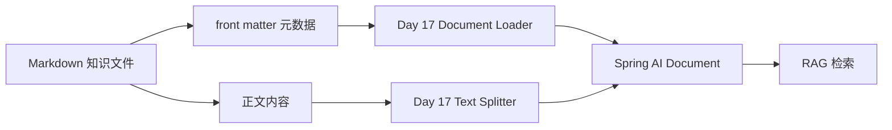

# Day 16：整理知识库结构

## 结论

Day 16 建立了阶段 4 的知识库文件结构：

```text
projects/enterprise-customer-service-agent/knowledge-base/
  default/
    faq/
    policies/
    products/
```

每份知识都使用 Markdown 保存，并通过 YAML front matter 明确 `source`、`tenant`、`version`、`category`。今天只定义结构和样例内容，不接入 Spring AI RAG、向量库或运行时多租户隔离。

## 今日目标

1. 建立 FAQ、政策、产品知识目录。
2. 使用统一元数据描述每份知识。
3. 从 Week10 参考资料抽取默认租户样例知识。
4. 为 Day 17 的 Document Loader 和 RAG 检索准备稳定输入格式。

## 业务场景

### FAQ 问答

用户问：

```text
这门 AI Agent 课程适合新手吗？
```

后续 RAG 应能命中：

```text
knowledge-base/default/faq/learning-readiness.md
```

并返回课程适合人群、前置基础和企业级落地方向。

### 政策解释

用户问：

```text
开课后还能退款吗？
```

后续 RAG 应能命中：

```text
knowledge-base/default/policies/refund-policy.md
```

并解释开课一周内与一周后的退款口径，同时提醒不能直接承诺退款成功。

### 产品咨询

用户问：

```text
你们有什么适合中小企业的轻量化 Agent 方案？
```

后续 RAG 应能命中：

```text
knowledge-base/default/products/lightweight-hybrid-agent-plan.md
```

并说明 Hybrid Agent 的适用场景和边界。

## 模块边界

### `knowledge-base` 负责

- 存放可检索的 Markdown 知识。
- 通过目录表达租户和分类。
- 通过 front matter 表达来源、租户、版本和分类。

### `customer-domain` 负责

- 继续提供 `KnowledgeItem`、`KnowledgeCategory`、`KnowledgeStatus` 等领域模型。
- 不关心 Markdown 文件读取、切片或向量索引细节。

### 当前不负责

- 不实现 Spring AI `DocumentReader`。
- 不实现 Text Splitter。
- 不写 VectorStore 或 pgvector 数据。
- 不改 `/chat` 返回。
- 不实现租户运行时隔离。
- 不新增知识库管理 API。

## 元数据设计

每份知识文件都必须包含：

```yaml
---
title: "课程适合哪些学员"
source: "week10/work_v3/datas/data.txt#Q1-Q6"
tenant: "default"
version: "2026-06-29"
category: "FAQ"
tags:
  - "course-fit"
---
```

字段说明：

| 字段 | 说明 |
| --- | --- |
| `title` | 人类可读标题，用于调试台展示 |
| `source` | 原始业务口径来源，后续进入 RAG `sources` |
| `tenant` | 租户标识，当前样例统一为 `default` |
| `version` | 知识版本，当前使用日期版本 |
| `category` | 与 `KnowledgeCategory` 对齐：`FAQ`、`POLICY`、`PRODUCT` |
| `tags` | 辅助检索和调试，不作为 Day 16 必填验收项 |

## 数据流



## 安全边界

- 知识文件不保存 API Key、数据库密码、token 或用户隐私。
- `tenant` 必须显式写入，避免后续 Loader 把默认知识误加载到其他租户。
- 退款等高风险政策只提供解释和审批建议，不表达真实资金操作已经执行。
- `source` 指向业务参考来源，便于后续回答时展示证据，不允许用模型生成内容替代业务口径。

## 验证方式

目录存在性：

```bash
test -d projects/enterprise-customer-service-agent/knowledge-base/default/faq
test -d projects/enterprise-customer-service-agent/knowledge-base/default/policies
test -d projects/enterprise-customer-service-agent/knowledge-base/default/products
```

元数据完整性：

```bash
for file in projects/enterprise-customer-service-agent/knowledge-base/default/*/*.md; do
  rg -q '^source: ' "$file"
  rg -q '^tenant: ' "$file"
  rg -q '^version: ' "$file"
  rg -q '^category: ' "$file"
done
```

## 测试用例

| 检查 | 覆盖点 |
| --- | --- |
| 目录检查 | FAQ、政策、产品目录均存在 |
| front matter 检查 | 每份知识都有 `source`、`tenant`、`version`、`category` |
| 分类检查 | 样例分类只使用 `FAQ`、`POLICY`、`PRODUCT` |
| 内容检查 | 退款政策不承诺真实退款成功，产品知识不包含敏感配置 |

## 学习重点

### RAG 的输入格式先于检索算法

Day 16 不急着接 VectorStore。先把知识来源、租户、版本和分类表达清楚，Day 17 才能稳定地把 Markdown 映射成 Spring AI `Document`。

### source 是客服回答的证据链

后续 `sources` 面板不能只显示文件名，还要能解释业务口径来自哪里。`source` 字段就是 RAG 证据链的第一层。

### tenant 是隔离边界的起点

多租户不是 Day 19 才突然出现。Day 16 先要求每份知识显式声明 `tenant`，后续 Loader、VectorStore 和查询过滤才能保持一致。

## 原则应用

- KISS：只使用目录和 Markdown front matter，不引入数据库或索引。
- YAGNI：不提前实现 RAG、pgvector、管理 API 或租户拦截器。
- DRY：所有知识文件使用同一套元数据字段。
- SOLID：知识文件结构、领域模型、后续 Loader 和检索服务保持职责分离。
