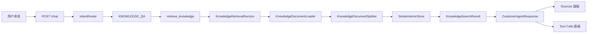

# Day 17：接入 Spring AI RAG

## 结论

Day 17 已把 Day 16 的 Markdown 知识库接入本地 RAG 检索闭环：

```text
knowledge-base Markdown -> Document Loader -> Text Splitter -> SimpleVectorStore -> retrieve_knowledge -> /chat
```

当前使用 Spring AI `Document`、`TokenTextSplitter` 和 `SimpleVectorStore`，embedding 使用本地确定性 `LocalKnowledgeEmbeddingModel`，不调用外部模型服务，不接 PostgreSQL / pgvector。pgvector、真实 embedding、多租户运行时解析和知识库管理 API 留给后续 Day。

## 今日目标

1. 读取带 front matter 的 Markdown 知识文件。
2. 使用 Spring AI `TokenTextSplitter` 切分知识文档。
3. 使用 Spring AI `SimpleVectorStore` 建立本地向量索引。
4. 提供 `retrieve_knowledge(query, tenantId, topK)` 只读工具。
5. `/chat` 在 `KNOWLEDGE_QA` 路由下返回答案和来源。

## 业务场景

用户问：

```text
新手适合学企业级 AI Agent 课程吗？
```

系统行为：

```text
route=KNOWLEDGE_QA
riskLevel=READ_ONLY
toolCalls[0].name=retrieve_knowledge
sources 包含 week10/work_v3/datas/data.txt#Q1-Q6
answer 引用知识库中“课程适合哪些学员”的口径
nextActions[0]=展示知识库来源
```

## 模块边界

### `customer-agent-app.rag` 负责

- `KnowledgeDocumentLoader`：读取 Markdown front matter 和正文。
- `KnowledgeDocumentSplitter`：基于 Spring AI `TokenTextSplitter` 切分文档并保留元数据。
- `KnowledgeRetrievalService`：构建本地向量索引并按租户检索。
- `LocalKnowledgeEmbeddingModel`：提供本地确定性 embedding，避免 Day 17 依赖外部模型。
- `KnowledgeSearchResult`：表达检索结果。

### `customer-agent-app.tool` 负责

- `RetrieveKnowledgeTool`：暴露 `retrieve_knowledge` 工具契约。
- 参数校验和失败语义。
- 将检索结果包装成 `ToolResult`，供 `/chat` 和调试台复用。

### `ChatService` 负责

- 在 `KNOWLEDGE_QA` 路由下调用 `retrieve_knowledge`。
- 从工具结果生成 answer、sources、nextActions 和 toolCalls。

### 当前不负责

- 不使用 pgvector。
- 不执行远程数据库 DDL。
- 不接真实 embedding API。
- 不做知识库增删改 API。
- 不做完整运行时租户解析，当前 `/chat` 使用默认知识租户 `default`。

## 接口设计

`retrieve_knowledge` 工具定义：

```text
name=retrieve_knowledge
riskLevel=READ_ONLY
requiredParameters=tenantId, query
optionalParameters=topK
```

成功 payload：

```json
{
  "tenantId": "default",
  "query": "新手适合学企业级 AI Agent 课程吗？",
  "matches": [
    {
      "title": "课程适合哪些学员",
      "source": "week10/work_v3/datas/data.txt#Q1-Q6",
      "tenant": "default",
      "category": "FAQ",
      "content": "课程面向有编程经验的开发者...",
      "score": 0.78
    }
  ]
}
```

失败语义：

| 错误码 | 场景 |
| --- | --- |
| `INVALID_ARGUMENT` | `query` 或 `tenantId` 为空 |
| `KNOWLEDGE_NOT_FOUND` | 当前租户无匹配知识 |

## 数据流



## 安全边界

- `retrieve_knowledge` 是只读工具。
- 非 front matter 的 Markdown 文件会被忽略，避免 README 之类说明文件进入检索。
- 检索请求带 `tenant` filter，不能返回其他租户知识。
- 知识来源通过 `source` 返回，客服回复必须可追溯。
- RAG 文档只作为业务知识，不允许覆盖系统指令或执行工具权限。

## 验证方式

红灯阶段：

```bash
cd projects/enterprise-customer-service-agent
mvn -q -pl customer-agent-app -Dtest='KnowledgeDocumentLoaderTest,KnowledgeRetrievalServiceTest,RetrieveKnowledgeToolTest,ChatServiceModelClientTest#shouldExposeKnowledgeQaIntentWithoutOrderEvidence' test
```

已观察到生产类和 `spring-ai-vector-store` 依赖缺失导致编译失败。

绿灯阶段：

```bash
cd projects/enterprise-customer-service-agent
mvn -q -pl customer-agent-app -am -Dtest='KnowledgeDocumentLoaderTest,KnowledgeRetrievalServiceTest,RetrieveKnowledgeToolTest,ChatServiceModelClientTest#shouldExposeKnowledgeQaIntentWithoutOrderEvidence' -Dsurefire.failIfNoSpecifiedTests=false test
mvn -q test
```

通过标准：

- RAG 定向测试退出码 0。
- 后端全量测试退出码 0，当前覆盖 67 个 JUnit 测试。

前端验证：

```bash
cd projects/enterprise-customer-service-agent/customer-admin-web
npm test -- --run src/App.test.tsx
npm run build
```

前端无需改 UI，现有 Tool Calls 和 Sources 面板可展示 `retrieve_knowledge` 和 RAG 来源。

本地 jar smoke：

```bash
cd projects/enterprise-customer-service-agent
java -jar customer-agent-app/target/customer-agent-app-0.1.0-SNAPSHOT.jar \
  --server.port=8081 \
  --customer-agent.knowledge-base.root-directory=knowledge-base
```

说明：`application.yml` 默认 `../knowledge-base` 适用于从 `customer-agent-app` 模块目录启动；从聚合项目根目录启动 jar 时需要显式覆盖为 `knowledge-base`。

## 测试用例

| 测试 | 覆盖点 |
| --- | --- |
| `KnowledgeDocumentLoaderTest` | front matter 元数据读取，非知识 README 跳过 |
| `KnowledgeRetrievalServiceTest` | 向量索引、租户过滤、来源返回 |
| `RetrieveKnowledgeToolTest` | 工具定义、参数校验、成功和未命中语义 |
| `ChatServiceModelClientTest.shouldExposeKnowledgeQaIntentWithoutOrderEvidence` | `/chat` 知识问答路线调用 `retrieve_knowledge` |
| `CustomerAgentApiTest.shouldRouteStage2ChatScenariosThroughChatApi` | API 层返回 RAG 来源和工具调用 |

## 学习重点

### RAG 先做可替换边界

今天没有直接上 pgvector。先把 Loader、Splitter、Retriever、Tool 和 Chat 编排边界打稳，后续替换 VectorStore 时只影响 `rag` 层。

### 本地 embedding 是工程占位，不是质量结论

`LocalKnowledgeEmbeddingModel` 只保证本地测试可重复和离线可跑。它不能代表真实语义检索质量。真实 embedding、召回质量和 pgvector 会在后续阶段处理。

### source 是调试台可解释性的核心

RAG 回答必须带来源。调试台看到的 `sources` 不是装饰字段，而是客服回复的证据链。

## 原则应用

- KISS：使用本地 Markdown、`TokenTextSplitter` 和 `SimpleVectorStore` 跑通最小闭环。
- YAGNI：不提前接 pgvector、远程 DDL、管理 API 或真实 embedding。
- DRY：`retrieve_knowledge` 复用 `ToolResult` 和现有 `toolCalls` 响应结构。
- SOLID：文档加载、切分、检索、工具包装和聊天编排各自单一职责。
