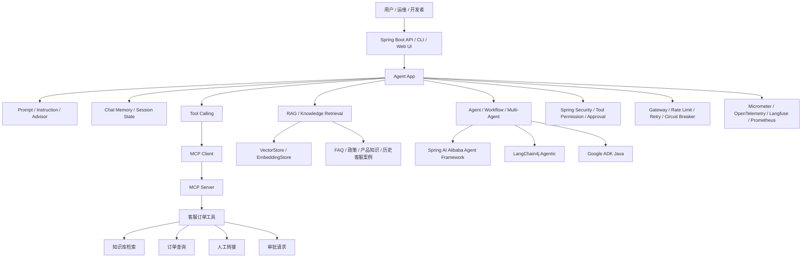

# 企业级 Spring Boot AI Agent 生态落地路线

## 结论

Java / Spring Boot 已经具备企业级 AI Agent 应用落地所需的完整生态，但它不是单一框架全包，而是组合式工程体系：

```text
Spring Boot
+ Spring AI
+ Spring AI MCP / MCP Java SDK
+ Spring AI Alibaba Agent Framework
+ Spring Security
+ Micrometer / OpenTelemetry
+ Langfuse / LangSmith 类观测平台
+ Spring Cloud Gateway / Resilience4j
+ Docker / Kubernetes / Prometheus / Grafana
```

本项目的主线仍然保持：

```text
Spring Boot + Spring AI + MCP 优先的企业客服订单 Agent
```

Spring AI Alibaba、LangChain4j、Google ADK Java 作为对照和扩展，不在第一阶段同时引入，避免过早复杂化。

## 行业通用性与版本基线

截至 2026-06-26，这条技术路线没有走偏，也没有使用明显落后的技术。它的核心判断是：

```text
企业级 Java AI 应用 = Spring Boot 工程体系 + Spring AI 能力层 + 标准 MCP 工具边界 + 可观测和安全治理
```

推荐基线：

| 能力层 | 推荐版本线 | 企业落地判断 |
| --- | --- | --- |
| JDK | Java 21 LTS 起步，Java 25 LTS 作为升级目标 | Java 25 是最新 LTS；Java 21 生态更稳，适合首版教学工程。 |
| Spring Boot | 4.1.x 优先，3.5.x 保守回退 | 4.1.x 是新项目现代基线；3.5.x 适合作为依赖兼容兜底。 |
| Spring AI | 2.0.x | 当前 Java AI 主线框架之一，覆盖 ChatClient、Tool Calling、RAG、MCP、Observability。 |
| MCP | Spring AI MCP + MCP Java SDK | 使用 Spring AI BOM 管理 MCP 依赖；独立 SDK 已进入 2.x，但不要在 Spring AI 项目中随意覆盖。 |
| 关系数据库 / 向量库 | PostgreSQL 18.x + pgvector 0.8.x | 适合企业订单、知识库、审计、向量检索统一治理。 |
| 缓存 / 会话 | Redis 8.x | 适合短期 Memory、Session、限流和热点缓存。 |
| Web 调试台 | Node.js 24 LTS + Vite 8.x + React 19.x + TypeScript 6.x | 现代前端主流组合；不使用 Create React App；如生态兼容不足，TypeScript 回退 5.9.x。 |
| UI / 服务端状态 | Ant Design 6.x + TanStack Query v5 | 企业中后台和调试台常用组合；Ant Design 5.x 只作为兼容兜底。 |
| 观测 | Actuator + Micrometer + OpenTelemetry | 与 Spring Boot 生态天然集成，后续接 Prometheus / Grafana。 |
| 监控 | Prometheus 3.x + Grafana 13.x | 行业通用开源监控组合。 |
| 部署 | Docker Compose v2 | 学习与单机验证足够；Kubernetes 作为后续生产化扩展。 |

具体 patch 版本不要提前写死。Day 02 创建工程时，需要按当日官方源确认并锁定：

- Maven BOM：Spring Boot、Spring AI。
- npm package：Vite、React、TypeScript、Ant Design、TanStack Query。
- Docker 镜像：PostgreSQL、pgvector、Redis、Prometheus、Grafana。

如果出现兼容冲突，回退顺序为：

1. 保持 Spring AI 2.0.x 不变，先回退 Spring Boot 到 3.5.x。
2. 保持 React 19 不变，选择兼容 React 19 的 Ant Design 稳定线。
3. 保持 PostgreSQL + pgvector 组合，不改成手写向量索引或临时文件向量库。
4. 保持 Prometheus + Grafana，不在 `customer-admin-web` 里复制完整监控平台。

## 目标边界

这份文档解决三个问题：

1. Java / Spring Boot 是否具备工具调用、MCP、Agent、多 Agent、Prompt、安全、服务治理、监控、调试这一整套生态。
2. 当前学习项目应该优先采用哪些组件。
3. 哪些开源项目适合作为参考，而不是直接照搬。

这份文档不解决：

1. 不直接替换当前 45 天学习路线。
2. 不把多 Agent、写操作审批、复杂工作流一次性加入 MVP。
3. 不引入 Python 训练链路作为 Java 主线的一部分。

## 分层生态图



## 能力到 Java 生态映射

| 能力域 | 推荐主线 | 可选对照 | 当前项目采用策略 |
| --- | --- | --- | --- |
| LLM API | Spring AI `ChatClient` / `ChatModel` | LangChain4j `ChatModel` | 主线使用 Spring AI |
| Prompt 工程 | Spring AI Prompt / Advisor / Structured Output | LangChain4j Prompt / Skills | 先沉淀系统指令、工具指令、报告格式 |
| 工具调用 | Spring AI Tool Calling | LangChain4j Tools | 先做只读工具，再迁移为 MCP |
| MCP | Spring AI MCP / MCP Java SDK | LangChain4j MCP | 主线采用 Spring AI MCP / MCP Java SDK |
| Web 调试台 | Vite / React / TypeScript / Ant Design / TanStack Query | Spring MVC 静态页 / Thymeleaf | 主线使用 Vite 本地调试台 |
| RAG | Spring AI RAG / VectorStore | LangChain4j RAG | 第 5 周后接入知识库检索 |
| Memory | Spring AI Chat Memory | LangChain4j Memory | 第 6 周后做短期会话记忆 |
| Agent 编排 | Spring AI Advisor + Tool Loop | Spring AI Alibaba / ADK Java / LangChain4j Agentic | 第一阶段不做复杂编排 |
| 多 Agent | Spring AI Alibaba Agent Framework | Google ADK Java / LangChain4j Agentic | 主线跑通后再作为扩展 |
| 安全 | Spring Security + 工具权限元数据 + 审批机制 | MCP OAuth / 自研策略引擎 | 先实现只读默认允许，高风险默认拒绝 |
| 服务治理 | Spring Cloud Gateway / Resilience4j / Spring Retry | Sentinel 等 | 后期接入限流、熔断、降级 |
| 监控追踪 | Spring Boot Actuator / Micrometer / OpenTelemetry | Langfuse / LangSmith / W&B | 先 trace 文件，后接 OpenTelemetry |
| 评测 | Spring AI Evaluation / 自建 eval cases | LangSmith / Ragas | 先维护本地 eval cases |
| 部署 | Docker / Kubernetes | Helm / Argo CD | 后期容器化部署 |

## 推荐技术栈

### 第一阶段：客服订单 Agent MVP

目标是把客服订单场景的 Agent 核心链路跑通，不做复杂多 Agent。

```text
Spring Boot
Spring AI
Spring AI MCP
MCP Java SDK
JUnit
本地 FAQ / 政策知识库
本地 trace 文件
```

核心能力：

- LLM API 调用
- 结构化诊断报告
- 订单查询工具调用
- 知识库检索
- MCP Server 暴露客服订单工具
- MCP Client 发现并调用工具
- 工具权限元数据
- 基础 Prompt / Instruction 约束

不做：

- 真实退款
- 真实取消订单
- 写数据库
- 调生产 API
- 多 Agent 自动协作

### 第二阶段：知识增强与记忆

```text
Spring AI RAG
Spring AI VectorStore
EmbeddingModel
Chat Memory
本地 / JDBC / Redis 存储
```

核心能力：

- 文档加载和切分
- FAQ、政策文档、产品知识和历史客服案例检索
- 检索结果引用来源
- 短期会话记忆
- 上下文压缩

设计约束：

- RAG 负责“知道更多再回答”。
- Tool Calling 负责“执行一个确定性动作或查询”。
- Memory 不保存敏感密钥、token、密码。

### 第三阶段：Agent 编排

```text
Spring AI Advisor
ToolCallingAdvisor
Spring AI Alibaba Agent Framework
```

核心能力：

- plan-act-observe-reflect-answer
- 最大循环次数限制
- 工具失败重试
- 工具调用链 trace
- 人工确认节点
- 简单 workflow

设计约束：

- 编排逻辑放在 Java 层，不写死在 Prompt 中。
- Prompt 只定义行为契约，不承载业务执行逻辑。
- 每个 Agent 或 workflow 节点必须职责单一。

### 第四阶段：多 Agent 与企业工作流

```text
Spring AI Alibaba Agent Framework
Google ADK Java
LangChain4j Agentic
```

适用场景：

- 一个问题需要多个专业角色协作。
- 需要并行分析多个证据源。
- 需要评审者 / 审批者 / 执行者分离。

客服订单 Agent 中的可选角色：

| Agent | 职责 |
| --- | --- |
| Intake Agent | 解析用户意图、订单号、租户和问题类型 |
| Knowledge Agent | 检索 FAQ、政策和产品知识 |
| Order Agent | 查询订单、支付和履约状态 |
| Risk Agent | 判断退款、取消、改签等操作风险 |
| Response Agent | 汇总证据，生成客服回复 |

第一阶段不实现这些角色，只保留后续扩展方向。

## 安全设计

### 工具风险分级

| 风险级别 | 示例 | 默认策略 |
| --- | --- | --- |
| `READ_ONLY` | 查询 FAQ、政策、产品、订单状态 | 默认允许 |
| `LOW_RISK_WRITE` | 创建人工转接记录、创建审批请求 | 需要显式配置 |
| `HIGH_RISK` | 真实退款、取消订单、改签、写生产数据库、调生产 API | 默认拒绝，必须人工审批 |

### Prompt Injection 防护

基础策略：

1. 工具层不信任模型生成的参数。
2. 路径必须限制在允许根目录内。
3. 订单、用户和支付相关字段必须脱敏。
4. RAG 文档中的指令性文本不能覆盖 system / developer instruction。
5. 高风险工具即使被模型调用，也必须进入审批流程。

### 权限边界

```text
用户请求
-> Agent 判断是否需要工具
-> 工具权限检查
-> 参数校验
-> 执行只读工具
-> 结果脱敏和裁剪
-> 写入 trace
-> 返回模型继续推理
```

## 服务治理

企业级 Agent 不是只把模型接进来，还要控制运行态风险。

| 治理能力 | Spring 生态方案 |
| --- | --- |
| 鉴权认证 | Spring Security |
| API 网关 | Spring Cloud Gateway |
| 限流 | Gateway RateLimiter / Redis RateLimiter |
| 熔断 | Resilience4j CircuitBreaker |
| 重试 | Resilience4j Retry / Spring Retry |
| 超时 | WebClient timeout / Resilience4j TimeLimiter |
| 降级 | fallback answer / 小模型兜底 / 禁用高成本工具 |
| 配置管理 | Spring Boot Configuration Properties |
| 健康检查 | Spring Boot Actuator |
| 灰度发布 | Kubernetes / Gateway / CI/CD |

Agent 侧必须额外治理：

- 最大工具调用次数
- 最大 Agent loop 次数
- 单次请求 token 预算
- 单次请求最大耗时
- 工具结果最大长度
- RAG 检索条数限制
- 敏感字段脱敏

## 监控、调试与评测

### 最小 trace 字段

```json
{
  "traceId": "string",
  "userQuestion": "string",
  "model": "string",
  "promptVersion": "string",
  "toolCalls": [
    {
      "name": "search_code",
      "arguments": {},
      "riskLevel": "READ_ONLY",
      "durationMs": 123,
      "status": "SUCCESS"
    }
  ],
  "retrieval": {
    "query": "string",
    "documents": []
  },
  "finalAnswer": {
    "riskLevel": "LOW",
    "summary": "string"
  }
}
```

### 观测指标

| 指标 | 用途 |
| --- | --- |
| LLM 调用耗时 | 判断模型响应瓶颈 |
| LLM 调用错误率 | 判断供应商或网络稳定性 |
| token 消耗 | 控制成本 |
| 工具调用次数 | 发现循环调用或过度调用 |
| 工具失败率 | 定位工具实现问题 |
| RAG 命中率 | 判断知识库质量 |
| 诊断报告通过率 | 评估 Agent 输出质量 |
| 人工审批拒绝率 | 发现模型高风险误判 |

### 调试入口

第一阶段：

- 本地 trace 文件
- 单元测试
- MCP contract test
- eval cases
- Vite 本地 Agent 调试台

后续阶段：

- OpenTelemetry trace
- Prometheus metrics
- Grafana dashboard
- Langfuse / LangSmith 类观测平台
- 自研 Agent 调试面板

### 调试台与监控台边界

| 界面 | 推荐实现 | 职责 |
| --- | --- | --- |
| Agent 调试台 | Vite + React + TypeScript + Ant Design | 调试对话、工具调用、RAG 来源、审批模拟 |
| 运行态监控台 | Prometheus + Grafana | 监控 metrics、延迟、错误率、资源状态和容量趋势 |

不建议第一版在 `customer-admin-web` 内自研完整监控 dashboard。更务实的方式是：

1. Spring Boot 暴露 Actuator / Micrometer 指标。
2. Prometheus 采集应用、中间件和 JVM 指标。
3. Grafana 导入 dashboard。
4. `customer-admin-web` 只提供 Grafana 链接或关键摘要。

## 开源项目参考清单

### 主线参考

| 项目 | 用途 | 学习方式 |
| --- | --- | --- |
| Spring AI | Spring Boot AI 应用主框架 | 主线学习 |
| Spring AI Examples | 官方示例，覆盖 prompt、advisor、agentic patterns、MCP | 按主题拆解 |
| MCP Java SDK | Java MCP 协议实现 | 主线学习 |
| Spring AI Alibaba | 多 Agent、workflow、企业级 Agent 平台 | 主线跑通后重点学习 |
| Spring AI Alibaba Examples | 国内 Spring AI Agent 示例集合 | 对照实践 |

### 对照参考

| 项目 | 用途 | 何时看 |
| --- | --- | --- |
| LangChain4j | Java 版 LangChain 风格框架 | 对照工具调用、RAG、Memory |
| Google ADK Java | Agent-first 框架 | 对照多 Agent 与评测 |
| Langfuse | LLM 可观测性平台 | 做 trace 和评测平台时 |
| OpenTelemetry | 通用链路追踪标准 | 做生产化观测时 |

## 与当前项目的对应关系

当前项目：

```text
projects/enterprise-customer-service-agent
```

建议演进路径：

```text
阶段 1：客服订单 MVP
阶段 2：RAG / Knowledge Base / 引用来源
阶段 3：MCP Tools / Resources / Prompts
阶段 4：多租户 / 安全 / 审批
阶段 5：Memory / Context Compression
阶段 6：Agent 编排 / 多 Agent 扩展
阶段 7：观测 / 评测 / 测试 / 部署
```

默认部署环境：

```text
主机：<DEV_SERVER_HOST>
用户：<DEV_SERVER_USER>
本地 SSH 证书：<SSH_IDENTITY_FILE>
连接示例：ssh -i <SSH_IDENTITY_FILE> <DEV_SERVER_USER>@<DEV_SERVER_HOST>
```

部署设计默认覆盖：

- Spring Boot Agent 服务
- MCP Server
- PostgreSQL / pgvector
- Redis
- Prometheus / Grafana
- OpenTelemetry Collector（如后续启用）

远程服务器只作为 Day 30 之后的目标环境。前期优先完成本地 Docker Compose、配置模板和验收脚本；真正远程连接、上传、重启、执行 DDL 或修改中间件配置前必须再次确认。

数据库结构管理采用轻量人工流程：

- 不使用 Flyway / Liquibase。
- 不使用应用自动建表或自动改表。
- DDL 以 SQL 脚本入仓，人工确认后执行。
- 执行记录必须能追踪到脚本、目标库、执行时间、结果和验证命令。

当前阶段不应该急着引入：

- Spring AI Alibaba 多 Agent 全套能力
- Google ADK Java
- LangChain4j
- 完整工作流平台
- 自动写操作工具

原因：

1. MVP 的核心风险是工具边界和证据链，不是多 Agent 数量。
2. 多框架并行会稀释学习主线。
3. 企业落地优先保证可控、可测、可观测。

## 技术选型原则

### KISS

先用一个 Agent 串起：

```text
用户问题 -> 意图识别 -> 知识库或订单工具 -> 客服回复
```

不要一开始就拆成多个 Agent。

### YAGNI

只有当单 Agent 出现明确瓶颈时，才引入多 Agent：

- 证据收集可以并行。
- 审核逻辑需要独立角色。
- 不同问题类型需要不同工作流。

### DRY

这些能力必须统一封装：

- 模型调用
- 工具调用
- MCP 工具注册
- 权限检查
- 脱敏
- trace 记录
- 错误响应

### SOLID

职责边界：

| 层 | 职责 |
| --- | --- |
| Agent Orchestration | 决定下一步做什么 |
| Tool Registry | 管理工具定义和权限元数据 |
| MCP Server | 暴露标准化工具能力 |
| Tool Implementation | 执行只读查询 |
| RAG Service | 提供知识上下文 |
| Memory Service | 管理会话状态 |
| Trace Service | 记录可观测数据 |
| Security Service | 校验权限、审批和脱敏 |

## 推荐学习优先级

```text
P0：Spring AI Tool Calling
P0：Spring AI MCP / MCP Java SDK
P0：Prompt / Instruction / Structured Output
P0：工具权限、安全边界、参数校验

P1：Spring AI RAG / VectorStore
P1：Chat Memory / Context Compression
P1：Actuator / Micrometer / OpenTelemetry
P1：MCP contract test / eval cases

P2：Spring AI Alibaba Agent Framework
P2：LangChain4j 对照
P2：Google ADK Java 对照
P2：Langfuse / Dashboard

P3：复杂多 Agent
P3：可视化 workflow 平台
P3：自动执行写操作
```

## 外部参考

- Spring AI：<https://github.com/spring-projects/spring-ai>
- Spring AI Reference - Tool Calling：<https://docs.spring.io/spring-ai/reference/api/tools.html>
- Spring AI Reference - Advisors：<https://docs.spring.io/spring-ai/reference/api/advisors.html>
- Spring AI Reference - MCP：<https://docs.spring.io/spring-ai/reference/api/mcp/mcp-overview.html>
- Spring AI Reference - Observability：<https://docs.spring.io/spring-ai/reference/observability/index.html>
- Spring AI Examples：<https://github.com/spring-projects/spring-ai-examples>
- MCP Java SDK：<https://github.com/modelcontextprotocol/java-sdk>
- Spring AI Alibaba：<https://github.com/alibaba/spring-ai-alibaba>
- Spring AI Alibaba Examples：<https://github.com/spring-ai-alibaba/examples>
- LangChain4j：<https://github.com/langchain4j/langchain4j>
- LangChain4j MCP：<https://docs.langchain4j.dev/tutorials/mcp/>
- Google ADK Java：<https://github.com/google/adk-java>

## 最终判断

Spring Boot 方向可以完整覆盖企业级 AI Agent 落地需要的主干能力：

```text
工具调用
MCP
Agent
多 Agent
Prompt 工程
RAG
Memory
安全
服务治理
监控
调试
评测
部署
```

但落地策略必须分阶段：

1. 先做可控的只读 Agent。
2. 再补知识、记忆和上下文压缩。
3. 再做 Agent 编排和人工审批。
4. 最后引入多 Agent、平台化观测和生产部署。

这条路线比直接照搬 Python 生态更适合 Java 后端开发者，也更适合企业系统长期维护。
