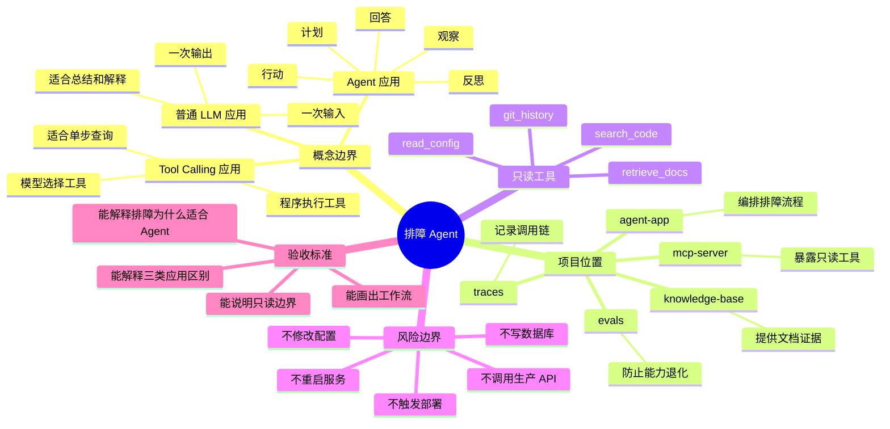

# Day 01 脑图：Agent 工作流

```mermaid
mindmap
  root((排障 Agent))
    概念边界
      普通 LLM 应用
        一次输入
        一次输出
        适合总结和解释
      Tool Calling 应用
        模型选择工具
        程序执行工具
        适合单步查询
      Agent 应用
        计划
        行动
        观察
        反思
        回答
    项目位置
      agent-app
        编排排障流程
      mcp-server
        暴露只读工具
      knowledge-base
        提供文档证据
      traces
        记录调用链
      evals
        防止能力退化
    只读工具
      search_code
      git_history
      read_config
      retrieve_docs
    风险边界
      不重启服务
      不修改配置
      不写数据库
      不触发部署
      不调用生产 API
    验收标准
      能解释三类应用区别
      能解释排障为什么适合 Agent
      能画出工作流
      能说明只读边界
```
