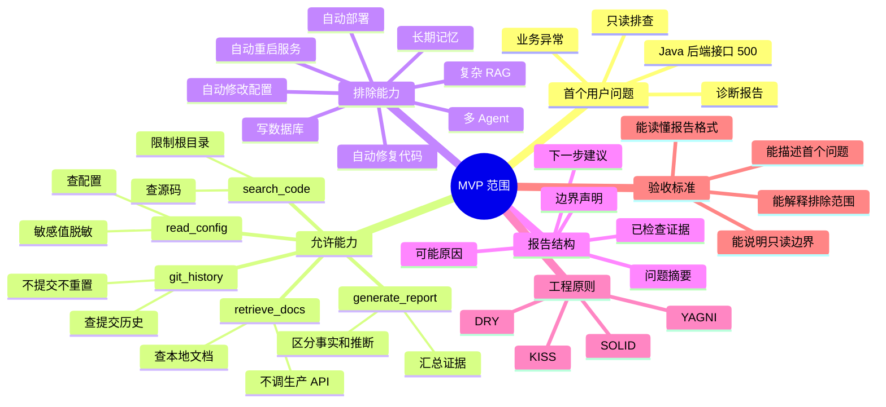

# Day 02 脑图：MVP 范围

```mermaid
mindmap
  root((MVP 范围))
    首个用户问题
      Java 后端接口 500
      业务异常
      只读排查
      诊断报告
    允许能力
      search_code
        查源码
        限制根目录
      read_config
        查配置
        敏感值脱敏
      git_history
        查提交历史
        不提交不重置
      retrieve_docs
        查本地文档
        不调生产 API
      generate_report
        汇总证据
        区分事实和推断
    排除能力
      自动修复代码
      自动修改配置
      自动重启服务
      自动部署
      写数据库
      多 Agent
      长期记忆
      复杂 RAG
    报告结构
      问题摘要
      已检查证据
      可能原因
      下一步建议
      边界声明
    工程原则
      KISS
      YAGNI
      DRY
      SOLID
    验收标准
      能说明只读边界
      能解释排除范围
      能描述首个问题
      能读懂报告格式
```
