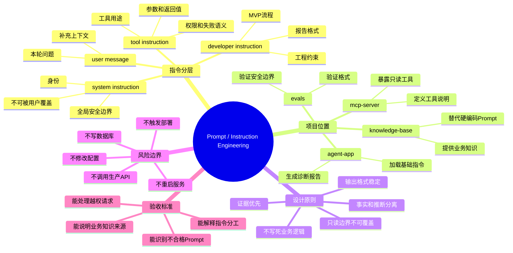

# Day 03 脑图：Prompt / Instruction Engineering

```mermaid
mindmap
  root((Prompt / Instruction Engineering))
    指令分层
      system instruction
        身份
        全局安全边界
        不可被用户覆盖
      developer instruction
        MVP流程
        报告格式
        工程约束
      tool instruction
        工具用途
        参数和返回值
        权限和失败语义
      user message
        本轮问题
        补充上下文
    项目位置
      agent-app
        加载基础指令
        生成诊断报告
      mcp-server
        暴露只读工具
        定义工具说明
      knowledge-base
        提供业务知识
        替代硬编码Prompt
      evals
        验证格式
        验证安全边界
    设计原则
      证据优先
      事实和推断分离
      输出格式稳定
      只读边界不可覆盖
      不写死业务逻辑
    风险边界
      不重启服务
      不修改配置
      不写数据库
      不触发部署
      不调用生产API
    验收标准
      能解释指令分工
      能识别不合格Prompt
      能说明业务知识来源
      能处理越权请求
```
