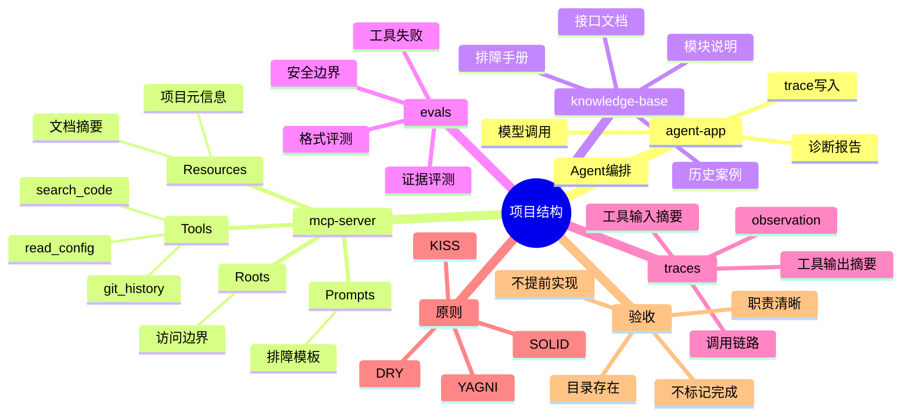

# Day 04 脑图：项目结构与模块边界

```mermaid
mindmap
  root((项目结构))
    agent-app
      Agent编排
      模型调用
      诊断报告
      trace写入
    mcp-server
      Tools
        search_code
        read_config
        git_history
      Resources
        项目元信息
        文档摘要
      Prompts
        排障模板
      Roots
        访问边界
    knowledge-base
      接口文档
      排障手册
      历史案例
      模块说明
    evals
      格式评测
      证据评测
      安全边界
      工具失败
    traces
      调用链路
      工具输入摘要
      工具输出摘要
      observation
    原则
      KISS
      YAGNI
      DRY
      SOLID
    验收
      目录存在
      职责清晰
      不提前实现
      不标记完成
```
