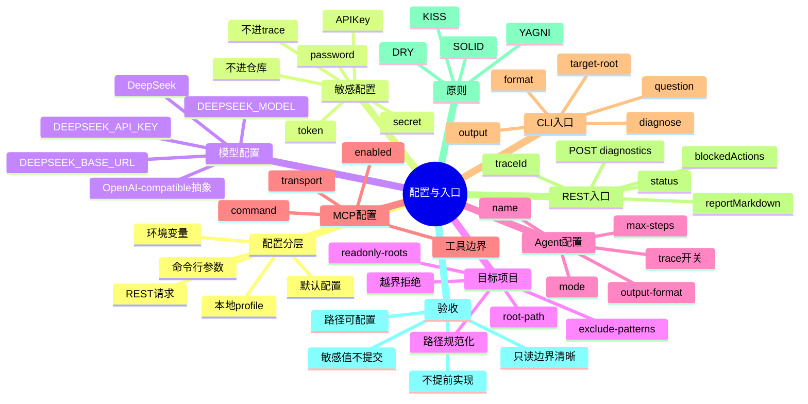

# Day 05 脑图：配置管理与运行入口

```mermaid
mindmap
  root((配置与入口))
    配置分层
      默认配置
      本地profile
      环境变量
      命令行参数
      REST请求
    敏感配置
      APIKey
      token
      secret
      password
      不进仓库
      不进trace
    模型配置
      DeepSeek
      DEEPSEEK_API_KEY
      DEEPSEEK_BASE_URL
      DEEPSEEK_MODEL
      OpenAI-compatible抽象
    目标项目
      root-path
      readonly-roots
      exclude-patterns
      路径规范化
      越界拒绝
    Agent配置
      name
      mode
      max-steps
      output-format
      trace开关
    MCP配置
      enabled
      transport
      command
      工具边界
    CLI入口
      diagnose
      question
      target-root
      output
      format
    REST入口
      POST diagnostics
      traceId
      status
      reportMarkdown
      blockedActions
    原则
      KISS
      YAGNI
      DRY
      SOLID
    验收
      敏感值不提交
      路径可配置
      只读边界清晰
      不提前实现
```
