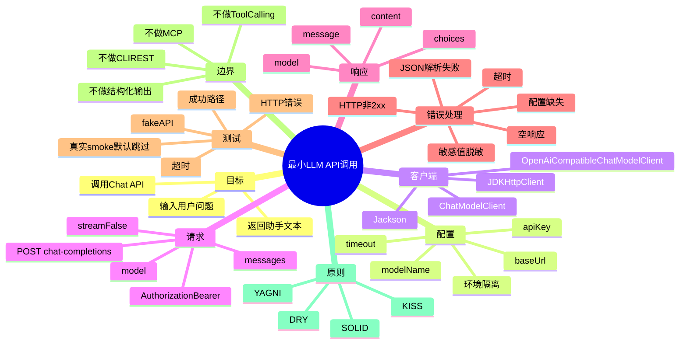

# Day 06 脑图：最小 LLM API 调用

```mermaid
mindmap
  root((最小LLM API调用))
    目标
      输入用户问题
      调用Chat API
      返回助手文本
    配置
      baseUrl
      apiKey
      modelName
      timeout
      环境隔离
    客户端
      ChatModelClient
      OpenAiCompatibleChatModelClient
      JDKHttpClient
      Jackson
    请求
      POST chat-completions
      AuthorizationBearer
      model
      messages
      streamFalse
    响应
      choices
      message
      content
      model
    错误处理
      配置缺失
      HTTP非2xx
      超时
      JSON解析失败
      空响应
      敏感值脱敏
    测试
      fakeAPI
      成功路径
      HTTP错误
      超时
      真实smoke默认跳过
    边界
      不做结构化输出
      不做ToolCalling
      不做MCP
      不做CLIREST
    原则
      KISS
      YAGNI
      DRY
      SOLID
```
