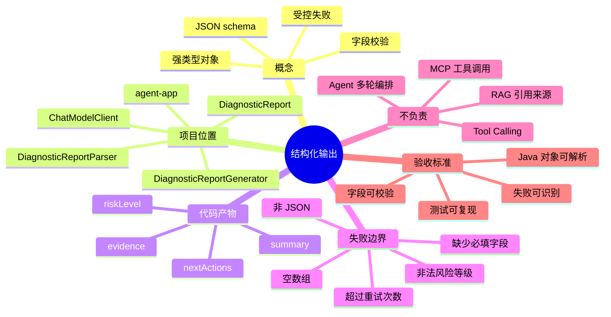

# Day 07 脑图：结构化输出

```mermaid
mindmap
  root((结构化输出))
    概念
      JSON schema
      强类型对象
      字段校验
      受控失败
    项目位置
      agent-app
      ChatModelClient
      DiagnosticReportGenerator
      DiagnosticReportParser
      DiagnosticReport
    代码产物
      summary
      evidence
      nextActions
      riskLevel
    失败边界
      非 JSON
      缺少必填字段
      空数组
      非法风险等级
      超过重试次数
    不负责
      Tool Calling
      MCP 工具调用
      RAG 引用来源
      Agent 多轮编排
    验收标准
      Java 对象可解析
      字段可校验
      失败可识别
      测试可复现
```
