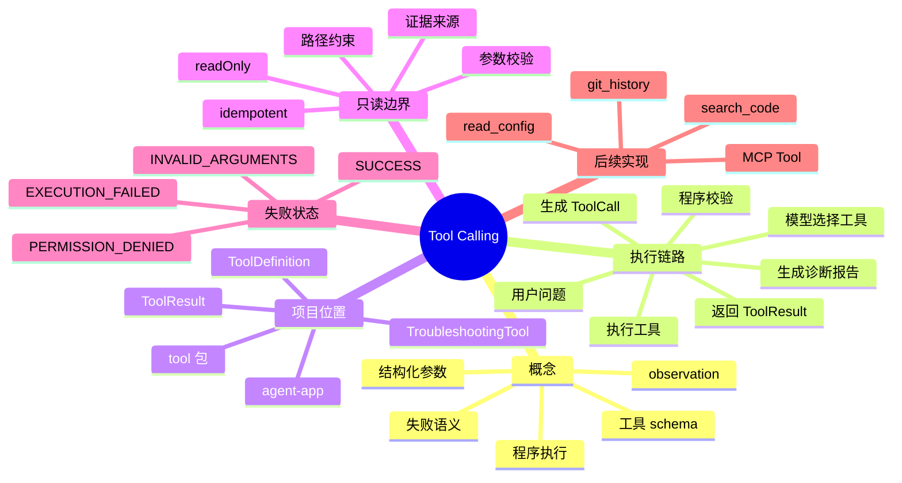

# Day 08 脑图：Tool Calling 执行模型

```mermaid
mindmap
  root((Tool Calling))
    概念
      工具 schema
      结构化参数
      程序执行
      observation
      失败语义
    执行链路
      用户问题
      模型选择工具
      生成 ToolCall
      程序校验
      执行工具
      返回 ToolResult
      生成诊断报告
    项目位置
      agent-app
      tool 包
      TroubleshootingTool
      ToolDefinition
      ToolResult
    只读边界
      readOnly
      idempotent
      参数校验
      路径约束
      证据来源
    失败状态
      SUCCESS
      INVALID_ARGUMENTS
      PERMISSION_DENIED
      EXECUTION_FAILED
    后续实现
      search_code
      git_history
      read_config
      MCP Tool
```
