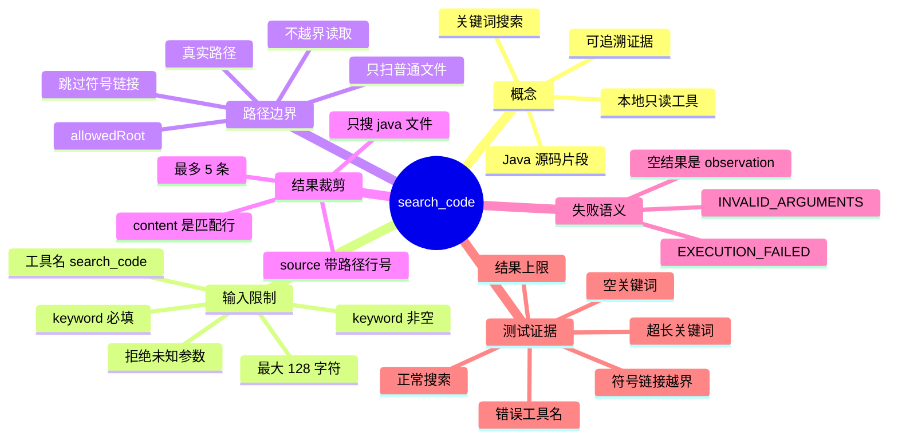

# Day 09 脑图：search_code 本地只读工具

```mermaid
mindmap
  root((search_code))
    概念
      本地只读工具
      关键词搜索
      Java 源码片段
      可追溯证据
    输入限制
      工具名 search_code
      keyword 必填
      keyword 非空
      最大 128 字符
      拒绝未知参数
    路径边界
      allowedRoot
      真实路径
      只扫普通文件
      跳过符号链接
      不越界读取
    结果裁剪
      只搜 java 文件
      最多 5 条
      source 带路径行号
      content 是匹配行
    失败语义
      INVALID_ARGUMENTS
      EXECUTION_FAILED
      空结果是 observation
    测试证据
      正常搜索
      空关键词
      超长关键词
      错误工具名
      结果上限
      符号链接越界
```
