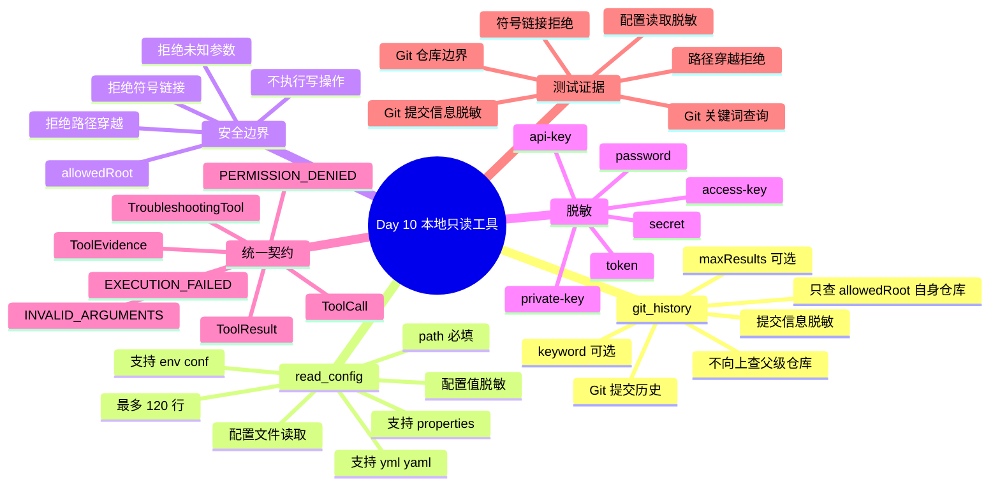

# Day 10 脑图：git_history 与 read_config

```mermaid
mindmap
  root((Day 10 本地只读工具))
    git_history
      Git 提交历史
      keyword 可选
      maxResults 可选
      只查 allowedRoot 自身仓库
      不向上查父级仓库
      提交信息脱敏
    read_config
      配置文件读取
      path 必填
      支持 properties
      支持 yml yaml
      支持 env conf
      最多 120 行
      配置值脱敏
    安全边界
      allowedRoot
      拒绝路径穿越
      拒绝符号链接
      拒绝未知参数
      不执行写操作
    脱敏
      password
      secret
      token
      api-key
      access-key
      private-key
    统一契约
      TroubleshootingTool
      ToolCall
      ToolResult
      ToolEvidence
      INVALID_ARGUMENTS
      PERMISSION_DENIED
      EXECUTION_FAILED
    测试证据
      Git 关键词查询
      Git 提交信息脱敏
      Git 仓库边界
      配置读取脱敏
      路径穿越拒绝
      符号链接拒绝
```
