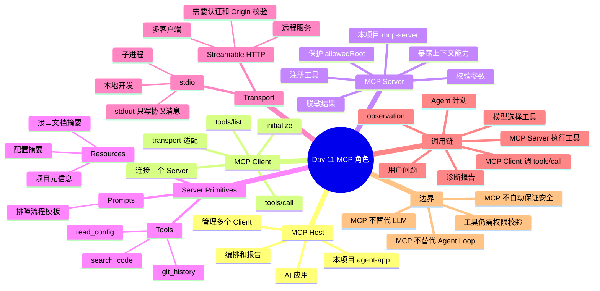

# Day 11 脑图：MCP 角色与调用链

```mermaid
mindmap
  root((Day 11 MCP 角色))
    MCP Host
      AI 应用
      管理多个 Client
      本项目 agent-app
      编排和报告
    MCP Client
      连接一个 Server
      initialize
      tools/list
      tools/call
      transport 适配
    MCP Server
      暴露上下文能力
      本项目 mcp-server
      注册工具
      校验参数
      保护 allowedRoot
      脱敏结果
    Server Primitives
      Tools
        search_code
        git_history
        read_config
      Resources
        项目元信息
        接口文档摘要
        配置摘要
      Prompts
        排障流程模板
    Transport
      stdio
        本地开发
        子进程
        stdout 只写协议消息
      Streamable HTTP
        远程服务
        多客户端
        需要认证和 Origin 校验
    调用链
      用户问题
      Agent 计划
      模型选择工具
      MCP Client 调 tools/call
      MCP Server 执行工具
      observation
      诊断报告
    边界
      MCP 不替代 LLM
      MCP 不替代 Agent Loop
      MCP 不自动保证安全
      工具仍需权限校验
```
