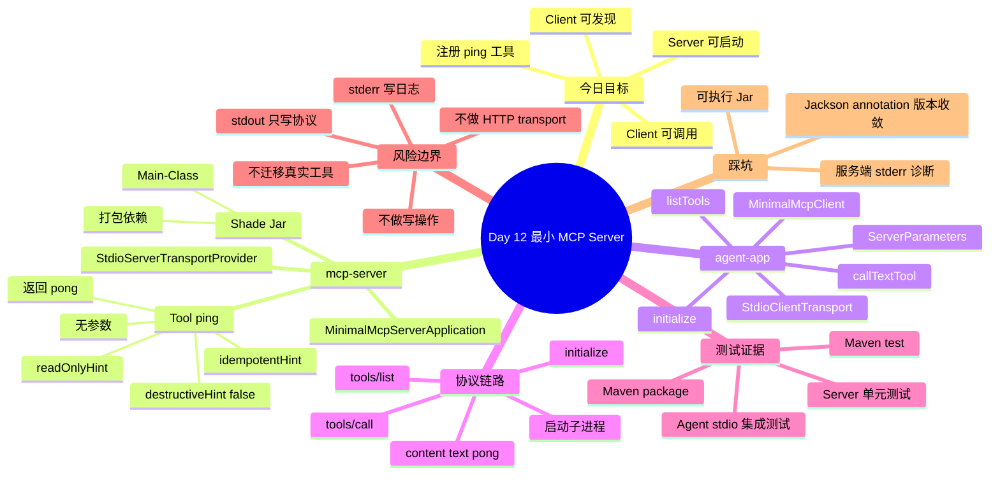

# Day 12 脑图：最小 MCP Server

```mermaid
mindmap
  root((Day 12 最小 MCP Server))
    今日目标
      注册 ping 工具
      Server 可启动
      Client 可发现
      Client 可调用
    mcp-server
      MinimalMcpServerApplication
      StdioServerTransportProvider
      Tool ping
        无参数
        返回 pong
        readOnlyHint
        idempotentHint
        destructiveHint false
      Shade Jar
        Main-Class
        打包依赖
    agent-app
      MinimalMcpClient
      ServerParameters
      StdioClientTransport
      initialize
      listTools
      callTextTool
    协议链路
      启动子进程
      initialize
      tools/list
      tools/call
      content text pong
    测试证据
      Server 单元测试
      Agent stdio 集成测试
      Maven package
      Maven test
    风险边界
      stdout 只写协议
      stderr 写日志
      不迁移真实工具
      不做 HTTP transport
      不做写操作
    踩坑
      Jackson annotation 版本收敛
      可执行 Jar
      服务端 stderr 诊断
```
