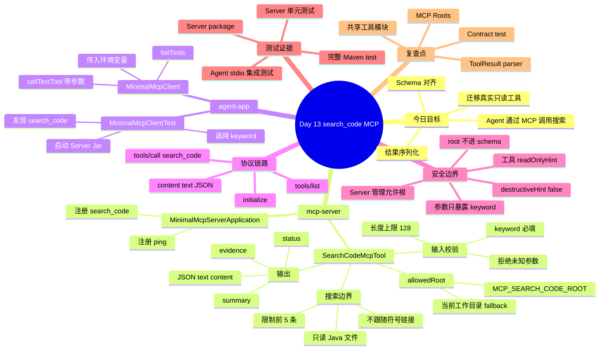

# Day 13 脑图：search_code 接入 MCP

```mermaid
mindmap
  root((Day 13 search_code MCP))
    今日目标
      迁移真实只读工具
      Agent 通过 MCP 调用搜索
      Schema 对齐
      结果序列化
    mcp-server
      MinimalMcpServerApplication
        注册 ping
        注册 search_code
      SearchCodeMcpTool
        allowedRoot
          MCP_SEARCH_CODE_ROOT
          当前工作目录 fallback
        输入校验
          keyword 必填
          长度上限 128
          拒绝未知参数
        搜索边界
          只读 Java 文件
          不跟随符号链接
          限制前 5 条
        输出
          JSON text content
          status
          summary
          evidence
    agent-app
      MinimalMcpClient
        传入环境变量
        listTools
        callTextTool 带参数
      MinimalMcpClientTest
        启动 Server Jar
        发现 search_code
        调用 keyword
    协议链路
      initialize
      tools/list
      tools/call search_code
      content text JSON
    安全边界
      root 不进 schema
      Server 管理允许根
      参数只暴露 keyword
      工具 readOnlyHint
      destructiveHint false
    测试证据
      Server 单元测试
      Server package
      Agent stdio 集成测试
      完整 Maven test
    复查点
      ToolResult parser
      共享工具模块
      MCP Roots
      Contract test
```
