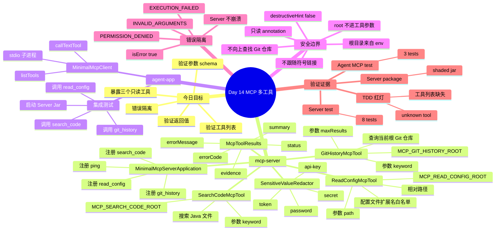

# Day 14 脑图：MCP 多只读工具注册

```mermaid
mindmap
  root((Day 14 MCP 多工具))
    今日目标
      暴露三个只读工具
      验证工具列表
      验证参数 schema
      验证返回值
      错误隔离
    mcp-server
      MinimalMcpServerApplication
        注册 ping
        注册 search_code
        注册 git_history
        注册 read_config
      SearchCodeMcpTool
        参数 keyword
        搜索 Java 文件
        MCP_SEARCH_CODE_ROOT
      GitHistoryMcpTool
        参数 keyword
        参数 maxResults
        查询当前根 Git 仓库
        MCP_GIT_HISTORY_ROOT
      ReadConfigMcpTool
        参数 path
        相对路径
        配置文件扩展名白名单
        MCP_READ_CONFIG_ROOT
      McpToolResults
        status
        summary
        evidence
        errorCode
        errorMessage
      SensitiveValueRedactor
        password
        token
        secret
        api-key
    agent-app
      MinimalMcpClient
        listTools
        callTextTool
        stdio 子进程
      集成测试
        启动 Server Jar
        调用 search_code
        调用 git_history
        调用 read_config
    安全边界
      根目录来自 env
      root 不进工具参数
      只读 annotation
      destructiveHint false
      不跟随符号链接
      不向上查找 Git 仓库
    错误隔离
      INVALID_ARGUMENTS
      PERMISSION_DENIED
      EXECUTION_FAILED
      isError true
      Server 不崩溃
    验证证据
      TDD 红灯
        unknown tool
        工具列表缺失
      Server test
        8 tests
      Server package
        shaded jar
      Agent MCP test
        3 tests
```
