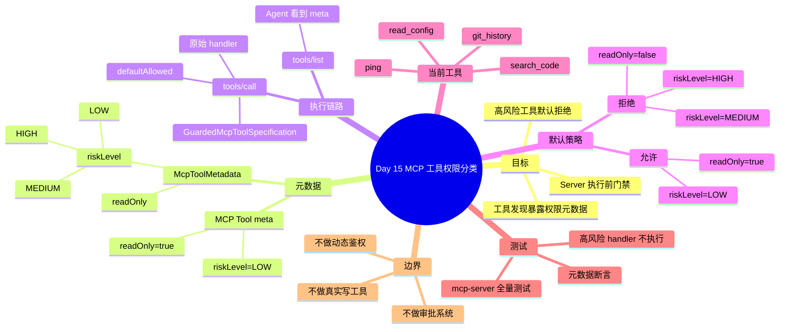

# Day 15 脑图：MCP 工具权限分类

```mermaid
mindmap
  root((Day 15 MCP 工具权限分类))
    目标
      工具发现暴露权限元数据
      Server 执行前门禁
      高风险工具默认拒绝
    元数据
      McpToolMetadata
        riskLevel
          LOW
          MEDIUM
          HIGH
        readOnly
      MCP Tool meta
        riskLevel=LOW
        readOnly=true
    执行链路
      tools/list
        Agent 看到 meta
      tools/call
        GuardedMcpToolSpecification
        defaultAllowed
        原始 handler
    默认策略
      允许
        readOnly=true
        riskLevel=LOW
      拒绝
        readOnly=false
        riskLevel=MEDIUM
        riskLevel=HIGH
    当前工具
      ping
      search_code
      git_history
      read_config
    测试
      元数据断言
      高风险 handler 不执行
      mcp-server 全量测试
    边界
      不做真实写工具
      不做审批系统
      不做动态鉴权
```
